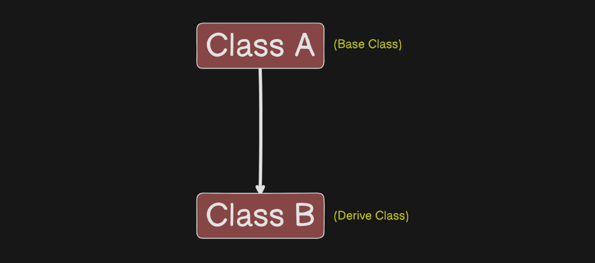
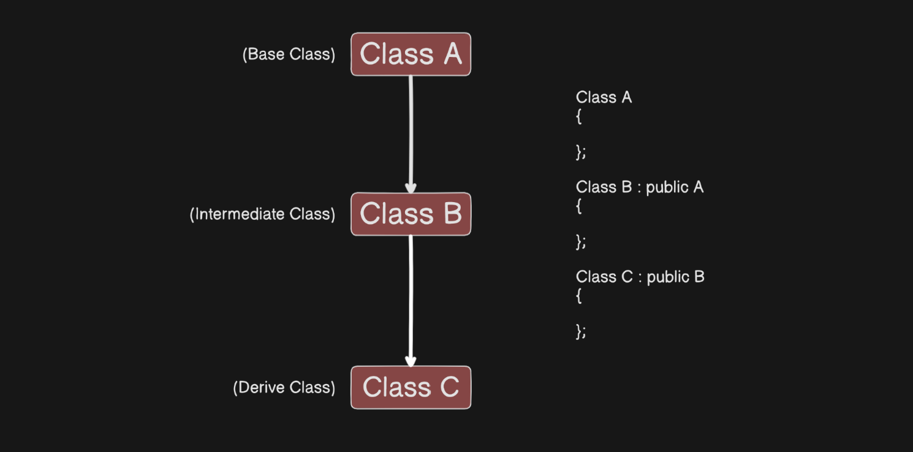
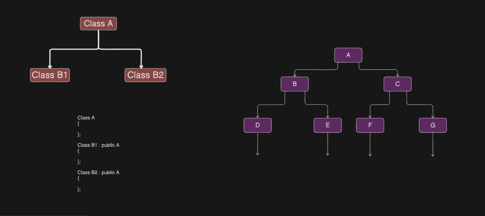
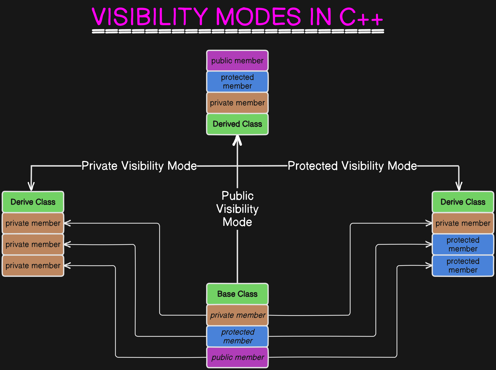

# C++ 

## Facts 
- Developed by **Bjarne Stroustrup** in `1979` at AT&T's Bell Laboratory 
- Due to the main use of classes, he initially named it **C with Classes**. But it was renamed as C++ in 1983 
- C++ is world's 4th most used programming language that was inspired by `Simula67` (A computer simulation language) 
- **Java**, along with major OS of modern times, are written in C++ 

## Features 
- C++ is a **middle-level** language that supports the principle of object-oriented paradigm (programming style) 
- C++ joins three separate programming traditions: 
  - *Procedural Language* tradition, represented by C 
  - *Object-Oriented Language* tradition, represented by class enhancements C++ adds to C 
  - *Generic Programming*, supported by C++ templates 

> **Note**: Generic Programming is a paradigm that allows you to write code that works with a variety of data types without the need to rewrite the code for each type. Achieved primarily using `templates`. 

## Comparision b/w C and C++ 
- C++ is subset of C language 
- A C++ program can use existing C software libraries 
- C follows a **top-down** approach and adopts **POP**, while C++ follows a **bottom-top** approach and adopts **OOP**.  

## OOP 
- OOP is a programming approach which revolves around the concept **_object_** 
- `Object`:
  - Any entity in the system that can be defined as a set of properties and set of operations performed using entity property set 
  - It allows decomposition of a problem into several entities called **object** and then building data and functions around them 

### Properties of OOPs 
1. **Encapsulation**: Wrapping up of data and functions into a single unit 
2. **Data Hiding**: The principle of restricting access to the internal state and implementation details of a class, typically achieved by using access specifiers like *private* and *protected* 
3. **Abstraction**: Hiding the complex implementation details of a system and exposing only the necessary and relevant features 
4. **Polymorphism**: Allows a function, method, or object to take on many forms, enabling a single interface to represent different underlying data types or classes, typically achieved through inheritance and function overriding 
5. **Inheritance**: Concept where a new class (derived class) is created from an existing class (base class), allowing the derived class to inherit and optionally override or extend the properties and behaviors (methods) of the base class
6. **Data Abstraction**: Process of reducing a body of data to a specific representation of whole. Classes use the concept of data abstraction, known as Abstract Data Types 

## Concept of Classes and Objects 
- A **Class** is a blue print of an object, while **Object** is a run time entity and is an instance of a class 
- Class is a description of Object's property set and set of operations 
- Creating a class is as good as defining a new data type  
- Class is a means to achieve encapsulation 
- Class members are by default private 

   

  ```md
  TOKENS (smallest individual unit in a program)
    |
    |__ Types: 1. Keyword
               2. Identifiers (name of variables, functions that are created by programmers)
               3. Constant
               4. String
               5. Operator
  ```

### Output Instruction 
- `cout` is used to send data/message to monitor 
- **cout** is a predefined object 
- The operator `<<` is called the *insertion* or *put-to* operator 

### Input Instruction 
- `cin`: used to input data from keyboard 
- **cin** is a predefined object 
- The operator `>>` is called the *extraction* or * get-to * operator  

### `wchar_t` 
- Data type used to represent wide characters 
- Designed to store characters that require more than one byte, such as Unicode 
- Used when one needs to handle *internationalization* and *different languages* in ones program 

### Reference Variable 
- It is an internal pointer and another name provided to the same variable. 
- **Declaration**: 
  - Preceded with `&` symbol 
  - Must be initialised during declaration 
  - Initialized with already declared variables only 

 

- **Use Cases**: 
  - **Function Parameters**: Pass variables by reference to avoid copying large structures or to allow the function to modify the argument. 
    ```cpp 
    using namespace std; 
    void increment(int& num) 
    { 
      num++; 
    } 

    int main() 
    { 
      int value = 5; 
      increment(value); 
      std::cout << value <<endl;                          // value is now 6 
      return 0; 
    } 
    ```  
  - **Return Values**: Functions can return references to allow modification of the caller's data 
    ```cpp 
    int& getElement(int* array, int index) 
    { 
      return array[index]; 
    } 

    int main() 
    { 
      int arr[3] = {1, 2, 3}; 
      getElement(arr, 1) = 10;                  // Modify the second element 
      std::cout << arr[1] << std::endl;         // Outputs 10 
      return 0; 
    } 
    ``` 
  - Passing large structures or objects by value can be inefficient, as it involves copying all data. Using references avoids the need for duplication 
    - `const` reference is used if the function does not need to modify the object, as it prevents unintentional changes 
  -  References enable efficient resource management by "moving" resources instead of copying, particularly with temporary or large objects 
    -  `std::move` facilitates moving resources using references 

### Inline Function 
- An inline function is used when we need to eliminate the cost of calls of small functions, and it is expanded in line where it is involved 
- Compiler replaces the function call with the corresponding function code 
- Just write `inline` at defining time  
- Its benefit decreases as the function grows 
- Compiler ignores the inline function in these listed cases: 
  - If function contains loops, switch, goto 
  - If there is recursion 
  - If it contains static variables 
- Example:
  ```cpp
  inline void fun();
  int main()
  {
    std::cout << "You are in main\n";
    fun();
  }
  void fun ()
  {
    std::cout << "You are in fun\n";
  }
  ```

## Function Overloading
```cpp
int add (int, int);
int main()
{
  int a, b;
  std::cout << "Enter two numbers";
  std::cin >> a >> b;

  std::cout << "Sum is " << add(a, b);

  int c;
  std::cout << "\nEnter three numbers";
  std::cin >> a >> b >> c;

  std::cout << "Sum is " << add(a, b, c);          
  //----> error: b/c add is defined only for two inputs
}
int add (int x, int y)
{
  return (x + y);
}

// CORRECTION:

int add (int, int, int = 0)
{
  return (x + y + z);
}
```
 
### Ways to resolve Function Overloading 
- **Exact Match**: Here, actual argument exactly matched with the parameter type of the overloaded function 
- **Match Through Promotion**:  
  - char, unsigned char, short is promoted to int 
  - float is promoted to double 
- **Conversion**: If no promotion is found, C++ tries to find a match through standard conversion 

## General Program in C++
```cpp
class Complex  // class donot consumes memory
{
  private:
    int a, b;  // instance member variables
  public:
    void setData (int x, int y)  // defined within the class
    {
      a = x;
      b = y;
    }
    void showData();
};
int main()
{
  Complex c1; // c1 is an object so it consumes memory
  c1.setData(3, 4);    
  c1.showData();
}
void Complex:: showData()
{
  std::cout << "\na = "<< a <<" b = " << b ;
}
```

## Function Call by passing object and returning object
```cpp
class Complex
{
  private:
    int a, b;
  public:
    void setData (int x, int y)
    {
      a = x;
      b = y;
    }
    void showData()
    {
      std::cout << "\na = "<< a <<" b = " << b ;
    }
    Complex add (Complex C)
    {
      Complex temp;
      temp.a = a+c.a;
      temp.b = b+c.b;
      return (temp);
    }
};
int main()
{
  Complex c1, c2, c3;
  c1.setData(3, 4);
  c2.setData(5, 6);
  c3 = c1.add(c2);                           
  //  c1 calls the add function where c2 passes as an argurmnt. Whatever c1 returns it get stored in c3
}
```

## Static Member Variables 
- It is declared inside the class body and defined outside the class body  
- Also known as class member variable 
- It belongs to whole class, not to any specific object 
- There will be only one copy of static variable for the whole class 
- Any object can use the same copy of class variable 
 
### Way to access Static Member Variable 
- **public**: 
  ```cpp 
  class Account 
  { 
    private:  
      int balance;          // instance member variable 
      static float roi;     // static member variable are also called class variable 
    public:  
      void setBalance (int b) 
      { 
        balance = b; 
      } 
  }; 
  float Account :: roi = 3.5f;   
  void main() 
  { 
    Account a1, a2; 
    Account :: roi = 4.5; 
  }
  ``` 
- **private**: 
  ```cpp 
  class Account 
  { 
    private: 
      int balance; 
      static float roi; 
    public: 
      void setBalance (int b) 
      { 
        balance = b; 
      } 
      void setroi (float r) 
      { 
        roi = r; 
      } 
  }; 
  float Account :: roi = 3.5f; 
  void main() 
  { 
    Account a1, a2; 
    a1.setRoi(4.5f); 
  } 
  ``` 
- **setRoi** is instance member function that requires object 
  ```cpp
  class Account
  {
    private:
      int balance;
      static float roi;
    public:
      void setBalance (int b)
      {
        balance = b;
      }
      static void setRoi (float r)
      {
        roi = r;
      }
  };
  float Account :: roi = 3.5f;
  void main
  {
    Account a1, a2;
    Account:: setRoi (4.5f);
  }
  ```
  - `setRoi` is instance member function that does not require an object  
 
## Static Member Function 
- Also called class member function 
- Can be involved with or without object 
- Only access static members of the class 

## Constructor 
- Here we normally used to write those things we want to add or implement just after object creation 
- Member function of a class 
- Its name is same as that of class name 
- It don't have any return type, so we do not add return keyword 
- Must be an instance member function, i.e, it can never be static  

### Ways to call a Constructor 
- A Constructor is implicitly invoked when an object is created 
- Used to solve problem of initialisation 
  ```cpp 
  class Complex 
  { 
    private: 
      int a, b; 
    public: 
      Complex() 
      { 
        std::cout << "Hello Constructor\n"; 
      } 
  }; 
  int main{ 
    Complex c1, c2, c3; 
    return 0; 
  } 
 
  /* 
  // OUTPUT: 
  Hello Constructor 
  Hello Constructor 
  Hello Constructor 
  */ 
  ``` 
 
- Why is it called constructor? 
  - Because it makes object an object 
- What is the problem of initialization? 
  - Whenever an object is created, it contains a garbage value, which means it does not represent someone, called problem of initialisation 
- Constructor is a guaranteed function that is called or made whenever an object is created 
- If we initialise some value to object using constructor, then it does not contain garbage value 
  ```cpp 
  class Complex 
  { 
    private: 
      int a, b; 
    public: 
      Complex (int x, int y) 
      { 
        a = x; 
        b = y; 
      } 
  }; 
  int main() 
  { 
    Complex c1(3, 4), c2; 
  } 
  ``` 
- This will give an error because the default constructor is not made. Since we have constructed a constructor 
  ```cpp 
  class Complex 
  { 
    private: 
      int a, b; 
    public: 
      Complex (int x, int y)     // Parameterized Constructor 
      { 
        a = x; 
        b = y; 
      } 
      Complex (int k)       // Parameterized Constructor 
      { 
        a = k; 
      } 
      Complex()   // Default Constructor 
      { } 
  }; 
  int main() 
  { 
    Complex c1(3, 4), c2, c3(5); 
    Commplex c4(c1);  // here, c1 is taken as single entity not the one who is taking two parameters 
  } 
  ``` 
- Complex c4 is not of any of the types listed above because: 
  - c1: Takes 2 arguments 
  - c4: Take only 1 argument of type complex, not int 
    - Therefore, we make **copy-constructor**  
    ```cpp 
    Complex(int x, int y) 
    { 
      a = x; 
      b = y; 
    } 
    Complex (int k) 
    { 
      a = k; 
    } 
    Complex (Complex C) 
    { 
      a = c.a; 
      b = c.b; 
    }; 
    int main() 
    { 
      Complex c1(3,4), c2, c3(5); 
      Complex c4(c1); 
    } 
    ``` 
- This will also give error, since c gets it value from c1 which further leds to recursion here 

   
   

## Operator Overloading 
- When an operator is overloaded with multiple jobs, it is known as operator overloading. 
- List of operators that cannot be overload are: 
  1. Scope Resolution Operator (`::`) 
  2. Ternary or Conditional Operator (`?:`) 
  3. Member Access or Dot operator (`.`) 
  4. Pointer-to-member Operator (`.\*`) 
  5. Object size Operator (`sizeof`) 
  6. Object type Operator (`typeid`) 
  7. `static_cast` (casting operator) 
  8. `const_cast` (casting operator) 
  9. `reinterpret_cast` (casting operator) 
  10. dynamic_cast (casting operator) 
- It is a way to implement compile time polymorphism. 
  - **Rules** 
    - Any symbol can be used as function name: 
      - If it is a valid operator in C Language. 
      - If it is preceded by operator keyboard. 
    - You cannot overload `sizeof` and `?:` operator. 

### Operator Overloading for Binary Operator 
- Two operands are namely: caller object and argument. 
- In Binary Operator the left operand is the caller object. Like in the 2nd example c3 = c1+c2 , c1 is the caller object. 
  ```cpp 
  class Complex 
  { 
    private: 
      int a,b; 
    public: 
      void setData ( int x, int y ) 
      { 
        a = x, b = y; 
      } 
      void showData() 
      { 
        std::cout<<"\na = "<<a<<"b = "<<b; 
      } 
      Complex add ( Complex c ) 
      { 
        Complex temp; 
        temp.a = a + c.a; 
        temp.b = b + c.b: 
        return (temp); 
      } 
  }; 
  void main() 
  { 
    Complex c1, c2, c3; 
    c1.setData(3,4); 
    c2.setData(5,6); 
    // c3 = c1 + c2; ------> gives error because it is non-preemptive type 
    c3 = c1.add(c2);     
    // Here,c1 calls add function, in which c2 is passed as an argument.  
    // Whatever gets returned is passed to the c3. 
  } 
  ``` 
- We can use an operator symbol in function name, but only by writing operator before it. 
  - **Example** `operator+()` 
- We can even call them without using dot operator. 
  ```cpp 
  class Complex 
  { 
    private: 
      int a,b; 
    public: 
      void setData ( int x, int y) 
      { 
        a = x, b = y; 
      } 
      void showData () 
      { 
        std::cout<<"\na = "<<a<<"b = "<<b; 
      } 
      Complex operator +( Complex c) 
      { 
        Complex temp; 
        temp.a = a + c.a; 
        temp.b = b + c.b: 
        return (temp); 
      } 
  }; 
  int main() 
  { 
    Complex c1, c2, c3; 
    c1.setData(3,4); 
    c2.setData(5,6); 
    c3 = c1 + c2; 
    return 0; 
  } 
  ``` 

#### `Operator *` Overloading 
```cpp 
#include <iostream> 
using namespace std; 
class Multiplication 
{ 
  private: 
    int n1, n2; 
  public: 
    void set_number(int num1, int num2) 
    { 
        n1 = num1; 
        n2 = num2; 
    } 
    void show_number() 
    { 
        cout << " Numbers for multiplications are: " << n1 << " and " << n2 << endl; 
    } 
    Multiplication operator*(Multiplication m) 
    { 
        Multiplication temp; 
        temp.n1 = n1; 
        temp.n2 = n2; 
        cout << "\nMultiplication is " << (temp.n1 * temp.n2) << endl; 
        return temp; 
    } 
}; 
int main() 
{
    Multiplication M, m; 
    M.set_number(2, 4); 
    M.show_number(); 
    m = M.operator*(M); //  M*M(simply) 
    return 0; 
} 
``` 

#### For Unary Opearator 
- Its operand is caller object. 
  ```cpp 
  class Complex 
  { 
    private: 
      int a,b; 
    public: 
      void setData ( int x, int y) 
      { 
         a = x, b = y; 
      } 
      void showData () 
      { 
        cout<<"\na = "<<a<<"b = "<<b; 
      } 
      Complex operator -( ) 
      { 
        Complex temp; 
        temp.a = - a ; 
        temp.b = - b : 
        return (temp); 
      } 
  }; 
  int main() 
  { 
    Complex c1, c2; 
    c1.setData(3,4); 
    c2 = c1.operator-();    // also -c1(); 
    c2.showData(); 
    return 0; 
  } 
  ``` 
 
#### Overloading of unary operator ++ (Pre and Post) 
- Whenever you call pre- and post-increment operators as functions then there is a chance of confusion for the compiler to decide between them. Therefore, in C++ we pass an int argument in case of post increment operator 
  ```cpp 
  class Integer 
  { 
    private: 
      int x; 
    public: 
      void setData ( int a ) 
      { 
        x = a; 
      } 
      void showData () 
      { 
        cout<<"x = "<<x; 
      } 
      Integer operator++()  //pre-increment 
      { 
        Integer i; 
        i.x = ++x; 
        return (i); 
      } 
      Integer operator++(int) // post-increment 
      {
        Integer i; 
        i.x = x++; 
        return (i); 
      } 
  }; 
  int main() 
  { 
    Integer i1, i2; 
    i1.setData(3); 
    i1.showData(); 
    i2 = i1++;      // i2 = i1.operator++(); 
    i1.showData(); 
    i2.showData(); 
    return 0; 
  } 
  ``` 

## Friend Function 
- Friend Function is not a member function of a class to which it is a friend. 
- Friend Function is declared in the class with friend keyboard. 
- It must be defined outside the class to which it is friend. 
  
  ```cpp 
  class Complex 
  { 
    private: 
      int a, b; 
    public: 
      void setData ( int x, int y ) 
      { 
        a = x, b = y; 
      } 
      void showData () 
      { 
        std::cout<<"\na"<<a<<" b"<<b; 
      } 
      friend void fun (Complex c); 
  }; 
  void fun () 
  { 
    std::cout<<"Sum is "<< c.a+c.b; 
  } 
  void main () 
  { 
    Complex c1; 
    c1.set_data(); 
    fun(c1); 
    return 0; 
  } 
  ``` 

### Friend Fxn can become friend to more than one class 
```cpp 
class B; 
class A 
{ 
  private: 
    int a; 
  public : 
    void setData (int x) 
    { 
      a = x; 
    } 
    friend void fun(A,B); 
}; 
class B 
{ 
  private : 
    int b; 
  public: 
    void setData (int y) 
    { 
      b = y; 
    } 
    friend void fun (A,B); 
}; 
void fun (A o1, B o2) 
{ 
  cout<<"sum is "<< o1.a+o2.b; 
} 
int main() 
{ 
  A obj1; 
  B obj2; 
  obj1.setData(2); 
  obj2.setData(3); 
  fun(obj1,obj2); 
  return 0; 
} 
``` 
 
### Overloading of functions using Friend Function 
1. **Plus(+) Operator** 
  ```cpp 
  class Complex 
  { 
    private: 
      int a,b; 
    public: 
      void setData (int x, int y) 
      { 
        a = x; 
        b = y; 
      } 
      void showData() 
      { 
        cout<<"\na="<<a<<" b="<<b; 
      } 
      friend Complex operator+ ( Complex X, Complex Y ); 
  }; 
  Complex operator+ (Complex X, Complex Y) 
  { 
    Complex temp; 
    temp.a = X.a+Y.a; 
    temp.b = X.b+Y.b; 
    return (temp); 
  } 
  int main() 
  { 
    Complex c1, c2, c3; 
    c1.setData(3,4); 
    c2.setData(5,6); 
    c3 = c1+c2; // c3 = operator+(c1,c2); 
    c3.showData(); 
    return 0; 
  } 
  ``` 

2. **Unary Operator** 
  ```cpp 
  class Complex 
  { 
    private: 
      int a, b; 
    public: 
      void setData (int x, int y) 
      { 
        a = x; 
        b = y; 
      } 
      void showData () 
      { 
        cout<<"\na="<<a<<" b="<<b; 
      } 
      friend Complex operator- (Complex); 
  }; 
  Complex operator- (Complex) 
  { 
    Complex temp; 
    temp.a = -X.a; 
    temp.b = -Y.b; 
    return (temp); 
  } 
  int main() 
  { 
    Complex c1, c2; 
    c1.setData (3,4); 
    c2 = -c1;         /*c2 = operator-(c1)*/ 
    c1.showData(); 
    c2.showData(); 
  } 
  ``` 
 
3. Insertion and Extraction operator 
  ```cpp 
  class Complex 
  { 
    private: 
      int a, b; 
    public: 
      void setData (int x, int y) 
      { 
        a = x; 
        b = y; 
      } 
      void showData () 
      { 
        cout<<"\na="<<a<<" b="<<b; 
      } 
      friend ostream& operator<< (ostream&, Complex); 
      friend istream& operator>> (istream&, Complex); 
  }; 
  ostream&  operator<<  (ostream & dout, Complex C) 
  { 
    cout<<"\na="<<C.a<<" b="<<C.b; 
  } 
  istream& operator>> (istream &din, Complex &C) 
  { 
    cin>>C.a>>C.b; 
    return (din); 
  } 
  int main() 
  { 
    Complex c1; 
    cout<<"Enter a complex number"; 
    cin>>c1; 
    cout<<"You entered"; 
    cout<<c1<<C2;       // operator<<(cout,c1); 
  } 
  ``` 

### Member function of one class can become friend to another class 

```cpp 
class A 
{ 
  public: 
  void fun() 
  {     } 
  void foo () 
  {     } 
}; 
class B 
{ 
  // friend void A: (to make all functions of class A friend.) 
  friend void A::fun(); 
  friend void A::foo(); 
}; 
void fun() 
{ 
 
} 
``` 
 
## Inheritance 
- It is a process of inheriting properties and behaviours of existing class into a new class. The capability of a class to derive properties and characteristics from another class is called Inheritance. 
- Other names of Base Class: Existing class, old class, Parent class  
- Other names of Derived Class: New class, Child class  
- The derived class now is said to be inherited from the base class 
- Inheritance is one of the most key features of Object-Oriented Programming 
- When a base class is privately inherited by the derived class, public members of the base class become the private members of the derived class and therefore, the public members of the base class can only be accessed by the member functions of the derived class. They are inaccessible to the objects of the derived class. 
- On the other hand, when the base class is publicly inherited by the derived class, public members of the base class also become the public members of the derived class. Therefore, the public members of the base class are accessible by the objects of the derived class as well as by the member functions of the derived class. 

  ```markdown 
  ### Syntax: 
  class Base_Class 
  { 
 
  }; 
  class Derived_Class : Visibility_Mode Base_Class 
  { 

  }; 

  Example: 
  class Car 
  { 
 
  }; 
  class SportsCar : public Car 
  { 
 
  }; 
  ``` 

### Types of Inheritance 
- Single Inheritance. 
- Multilevel Inheritance. 
- Multiple Inheritance. 
- Hierarchical Inheritance. 
- Hybrid Inheritance. 
 
### Single Inheritance 
- In single inheritance, a class is allowed to inherit from only one class. i.e., one subclass is inherited by one base class only. 
 
   

### Multilevel Inheritance 
- In this type of inheritance, a derived class is created from another derived class. 
  

### Multiple Inheritance 
- Multiple Inheritance is a feature of C++ where a class can inherit from more than one class. i.e., one subclass is inherited from more than one base class. 

   

### Hierarchical Inheritance 
- In this type of inheritance, more than one subclass is inherited from a single base class. i.e., more than one derived class is created from a single base class. 

   

### Hybrid (Virtual) Inheritance 
- Hybrid inheritance is implemented by combining more than one type of inheritance. For example: Combining hierarchical inheritance and multiple inheritance. 

   

### Multipath Inheritance 
- A derived class with two base classes and these two base classes have one common base class is called multipath inheritance. 
- Ambiguity can arise in this type of inheritance. 

  ```cpp 
  // C++ program demonstrating ambiguity in Multipath 
  // Inheritance 

  #include <iostream> 
  using namespace std; 

  class ClassA { 
    public: 
      int a; 
  }; 

  class ClassB : public ClassA { 
    public: 
      int b; 
  }; 

  class ClassC : public ClassA { 
    public: 
      int c; 
  }; 

  class ClassD : public ClassB, public ClassC { 
    public: 
      int d; 
  };

  int main() 
  { 
      ClassD obj; 

      // obj.a = 10;                 // Statement 1, Error 
      // obj.a = 100;                // Statement 2, Error 

      obj.ClassB::a = 10; // Statement 3 
      obj.ClassC::a = 100; // Statement 4 

      obj.b = 20; 
      obj.c = 30; 
      obj.d = 40; 

      cout << " a from ClassB  : " << obj.ClassB::a; 
      cout << "\n a from ClassC  : " << obj.ClassC::a; 

      cout << "\n b: " << obj.b; 
      cout << "\n c: " << obj.c; 
      cout << "\n d: " << obj.d << '\n'; 

      /* 
      In the above example, both Class-B and Class-C inherit Class-A, they both have a single copy of Class-A.  

      However, Class-D inherits both Class-B and Class-C, therefore Class-D has two copies of Class-A, one from Class-B and another from Class-C.  

      If we need to access the data member of Class-A through the object of Class-D, we must specify the path from which a will be accessed,  

      whether it is from Class-B or Class-C, because compiler cannot differentiate between two copies of Class-A in Class-D.*/ 
  } 
  ``` 
  - There are two ways to avoid this ambiguity: 
    1. Avoiding ambiguity using the *scope resolution operator*: Using the scope resolution operator, we can manually specify the path from which data members will be accessed 
    2. Avoiding ambiguity using the *virtual base class*: 
    ```cpp 
      #include<iostream> 

      class ClassA 
      { 
        public: 
          int a; 
      }; 

      class ClassB : virtual public ClassA 
      { 
        public: 
          int b; 
      };  

      class ClassC : virtual public ClassA 
      { 
        public: 
          int c; 
      }; 

      class ClassD : public ClassB, public ClassC 
      { 
        public: 
          int d; 
      }; 

      int main() 
      { 
          ClassD obj; 

          obj.a = 10;       // Statement 3 
          obj.a = 100;      // Statement 4 
 
          obj.b = 20; 
          obj.c = 30; 
          obj.d = 40; 

          cout << "\n a : " << obj.a; 
          cout << "\n b : " << obj.b; 
          cout << "\n c : " << obj.c; 
          cout << "\n d : " << obj.d << '\n'; 
      } 
      ``` 
    - According to the above example, Class-D has only one copy of Class-A, therefore, statement 4 will overwrite the value of a, given in statement 3. 

## Visibility Modes 
- **Private Mode**: If we derive a subclass from a Private base class. Then both public members and protected members of the base class will become Private in the derived class. 
- **Protected Mode**: If we derive a subclass from a Protected base class. Then both public members and protected members of the base class will become protected in the derived class. 
- **Public Mode**: If we derive a subclass from a public base class. Then the public member of the base class will become public in the derived class and protected members of the base class will become protected in the derived class. 
- The private members in the base class cannot be directly accessed in the derived class, while protected members can be directly accessed. 

   

## Constructor & Destructor in Inheritance 
- **Some Rules**: 
  - Child class constructors call the parent class constructor. 
  - Order of execution of constructor in inheritance: from `parent to child`. 
  - Order of call of constructor in inheritance: from `child to parent`. 
    ```cpp 
    class A 
    { 
      public: 
      A() // Default Constructor 
      {  } 
    }; 
    class B : public A 
    { 
      public: 
      B():A() // Way to call parent constructor. 
      {  } 
      /* 
      B(){} -----> here compiler itself writes the calling statement for the default constructor of parent class. i.e. B():A(){ } 
      */ 
    }; 
    /* 
    Here, ""In B():A(){ }"" -----> this implies that firstly the child constructor gets called, and after that the control is passed to the parent class.  In this way, firstly the execution of the parent constructor takes place. 
    */ 
    int main() 
    { 
      B obj; 
    } 
    ``` 
 
- If we do not make child class constructor, then compiler makes the default constructor and calls the parent default constructor. 
  - If there is already a constructor present in parent class, then this will show error and for this we must call the parent constructor with default arguments. 
- If we do not write the constructor for the parent class then, by default compiler calls the default constructor. 

### Way to pass the arguments using constructor 
```cpp 
class A 
{ 
  int a; 
  public: 
   A(int k) 
   { 
    a = k ; 
   } 
}; 
class B : public A 
{ 
  int b; 
  public: 
   B(int x, int y):A(x) 
   { 
    b = y; 
   } 
}; 
 
int main() 
{ 
  B obj(1,2); 
} 
``` 

- In case of **destructor** (to delete the resource memory of objects), firstly the coding of child class gets executed thereafter the parent calss gets executed. ------> opposite to constructor. 

  ```cpp 
  class A 
  { 
     int a; 
    public: 
    A(int k) 
    { a = k ;} 
    ~A() { }; 
  }; 
  class B : public A 
  { 
    int b; 
    public: 
    B(int x, int y):A(x) 
    { b = y; } 
    ~B(){ }; 
  }; 
  /* 
  At first the destructor of the child gets called, and after that the destructor of the parent gets called. 
  */

  int main() 
  { 
    B obj(1,2); 
  } 
  ``` 
 
## Object Pointer 
- A pointer containing the address of an object 
```cpp 
class Box 
{ 
  private: 
   int l, b, h; 
  public:
   void setDimension (int x, int y, int z) 
   { 
    l = x, b = y, h = z; 
   } 
   void showData () 
   { 
    cout<<"\nl = "<<l<<" b = "<<" h = "; 
   } 
}; 
int main() 
{ 
  Box *p, smallBox; 
  p = &smallBox; 

  p->setDimension(12,10,5)// same as smallBox.setDimension(12,10,5); 

  p->showDimension()// same as smallBox.showDimension() 

  return 0; 
}
```

## `this` Pointer 
- this is a keyboard. 
- this is a local object pointer in every instance member function containing the address of the caller object. 
- this pointer cannot be modified. 
- it is used to refer to a caller object in a member function. 
- this pointer contains the address of the caller object. 
  ```cpp 
  class Box 
  { 
    private: 
    int l, b, h; 
    public: 
    void setDimension (int l, int b, int h) 
    { 
      // name conflict happens,as the l is considered the local variables. 

      this->l = l, this->b = b, this->h = h; 
    } 

    void showData () 
    { 
      cout<<"\nl = "<<l<<" b = "<<" h = "; 
    } 
  }; 
  int main() 
  { 
    Box smallBox; 
    smallBox.setDimension(12,10,5); 
    smallBox.showDimension() 
    return 0; 
  } 
  ``` 

## `new` & `delete` 
- **`new`**: 
  - variables made from new are the examples of DMA. 
  - Therefore, they get memory at run time. 
    ```cpp 
    int *p = new int; 
    float *q = new float; 
    Complex *ptr = new Complex; 
    float *q = new float [5]; 
    ``` 
- **`delete`**: 
    ```cpp 
    delete p; 
    delete []p; 
    ``` 

## Method Overhiding 
1. **Method overloading** -------> function overloading 
2. **Method overriding** -------> function overriding ------> function name as well as its prototype is same in parent in child class. 
3. **Method Hiding** --------> function hiding ------> function name is same; the only difference is in the arguments. 

 

 

- There is an error (==> since obj jo hai wo B ka hai to f2 function B mein searrch hoga , lekin yahan pe f2 function to hai lekin prototype different hai esliye errror show karega.) 

- **_Early Binding_**: In this concept, it is the compiler's duty to match the accurate function during the compilation. 
   
 
## Function Overloading 
- For function overloading, all the versions of the function must lie in the same class; otherwise, we cannot say it is function overloading. 

### Virtual Function 
- If you have made a pointer to `parent` class, then it can point to `child` class too, or you can say it can point to all the descendant classes. But vice versa is not true. 
- used in case of function overriding. 
- In case of early binding, two cases happen: 
  1. For object: Here, the compiler decides, as per the type of object, what functions to bind. 
  2. For Pointers: Here, the compiler decides according to the caller of the pointer class what functions to bind. 
    ```cpp 
    class A 
    { 
      public: 
      void f1() { } 
    }; 
    class B: public A 
    { 
      public: 
      void f1() { } // function overriding 
      void f2() { } 
    }; 
    int main() 
    { 
          //  For Pointers: 
      A *p, o1; 
      B o2; 
      p = &o2; 
      p->f1();  // A 

          //   For Objects: 
      A *p, o1; 
      B o2; 
      p = &o2; 
      o2.f1();  //  B 
    } 
    /* 
    Child ke object ke liye child ki pointer chale; lekin hm jaise parent ke pointer k through calling  karte hai, child k object bnane ke to bhi child k nhi chal tha balki pointer k chal rha. 

    Solution: To avoid early binding. i.e, Replace void f1() { } by ------> virtual void f1() {} 
    */
    ``` 

### Virtual Function Working Concept 

 

 

 

- For late binding ----------> We take pointer's type as our choice. 
- In case of inheritance, if in any class that has at least one `virtual function`, the compiler will automatically declare a variable within that class as a member, named `*_vptr` (instance member). 
- In a child class, a separate `vptr` is not created because it is inherited. 
- Compiler makes a static array (called `vtable`) whose address is stored in vptr. 
- This static array is made for each class. 
- In every class that contains a virtual function, and in all its descending classes the compiler will create a vtable; a `vtable` is a static array of virtual functions 
- They contain address of only virtual function. 
 
## Abstract in C++ 
- A class that contains at least one pure virtual function is called an `abstract class`, and an object of such a class is never instantiated. 

### Pure Virtual Functions 
- A do-nothing function is a pure virtual function. 
- `example`: virtual void fun( )= 0; 
- A class that has functions with no implementation cannot have an object; to use such a class, a child class must be created. 
- When creating its child class, it is necessary to perform function overriding so that it can call those functions. 
- If early binding occurs, the parent class can execute; therefore, we make it virtual. To determine what the pointer is pointing to, we consider it as the base—refer to the virtual function concept for more information. 

## Template in C++ 
- The keyword template is used to define function template and class template. 
- It is a way to make your function or class generalise as far as data type is concern. 
  1. **FUNCTION TEMPLATE**: 
    - While performing early binding, the compiler replaces the placeholders, such as `x` with the data type observed in the argument. 
    - If we need to perform function overloading only because the number of arguments is the same, and only the data type differs, in such a case, instead of creating distinct functions, you can create a single function that is generalized enough. 
    - If you pass values of diverse types, it will show results according to the type of values. This can be achieved using function templates. 
    - A function template is a generic function, and to create it, we use the template keyword before the function. Inside angular brackets, we use class, and then placeholders like X, so that X can be replaced with the data type. 
    - `template<class type> type func_name(type arg1,...)` 
      ```cpp 
      #include <iostream> 
      using namespace std; 
      /* "WITHOUT TEMPLATE" 
      int big(int a, int b) 
      { 
          if (a > b) 
              return (a); 
          else 
              return (b); 
      } 
      double big(double a, double b) 
      { 
          if (a > b) 
              return (a); 
          else 
              return (b); 
      } 
      int main() 
      { 
          cout << big(4, 5); 
          cout << big(5.6, 3.4); 
          return 0; 
      } 
      */ 
      // "WITH TEMPLATE" 
      template <class X> X big(X a, X b) 
      { 
          if (a > b) 
              return (a); 
          else 
              return (b); 
      } 
      /* "TEMPLATE FOR TWO DATATYPES" 
      template <class X> X big(X a, X b) 
      { 
          if (a > b) 
              return (a); 
          else 
              return (b); 
      } 
      */ 
      int main() 
      { 
          cout << big(4, 5); 
          cout << big(5.6, 3.4); 
          return 0; 
      } 
      ```

  2. **CLASS TEMPLATE**: 
    - Class template is also known as generic class. 
    - `template<class type> class class_name{.....}` 
      ```cpp 
      #include <iostream> 
      using namespace std; 
      class ArrayList 
      { 
      private: 
          struct ControlBlock 
          { 
              int capacity; 
              int *arr_ptr; 
          }; 
          ControlBlock *s; 
      public: 
          ArrayList(int capacity) 
          { 
              s = new ControlBlock; 
              s->capacity = capacity; 
              s->arr_ptr = new int[s->capacity]; 
          } 
          void addElement(int index, int data) 
          { 
              if (index >= 0 && index <= s->capacity - 1) 
                  s->arr_ptr(index) = data; 
              else 
                  cout << "\nArray index is not valid"; 
          } 
          void viewElement(int index, int &data) 
          { 
              if (index >= 0 && index <= s->capacity - 1) 
                  data = s->arr_ptr(index); 
              else 
                  cout << "\nArray index is not valid"; 
          } 
          void viewList() 
          { 
              int i; 
              for (i = 0; i < s->capacity; i++) 
                  cout << " " << s->arr_ptr[i]; 
          } 
      }; 
      int main() 
      { 
          int data;

          ArrayList list1(4); 
          list1.addElement(0, 32); 
          list1.addElement(1, 41); 
          list1.addElement(2, 55); 
          list1.viewList(); 

          return 0; 
      } 
      ``` 
## File Handling In C++ 
### Data Persistence 
- Life of Data. 
- To make the data exist after the completion of the program, we need file handling. 

 

### Streams 
 
- **Output Stream**: Data flows from variable to file. 
- **Input Stream**: Data flows from file to variables. 
- All those functions that manage the input and output strings are defined in a class in c++ 
- We can represent the input & output streams by making the objects of some pre-defined class. 
- We can represent the output stream using the object of `ofstream class` 
- We can represent the input stream using the object of `ifstream class` 
- To take i input, we make an object of `ifstream` function. 
- To make output, we make an object of `ofstream` function. 
- For file handling, we use: `ifstream`, `fstream`, `ofstream`. 
- For file handling, we use the header file `fstream`. 

 
 
```cpp 
#include<fstream> 
#include<iostream> 

int main() 
{ 
  ofstream fout; 
  fout.open("myfile.dat"); 
  fout<<"hello"; 
  return 0; 
} 
```

```cpp 
#include<iostream> 
#include<fstream> 

int main() 
{ 
  ifstream fin; 
  char ch; 
  fin.open("myfile.dat"); 
  fin>>ch; 
  while(!fin.eof()) 
  { 
    cout<<ch; 
    fin>>ch; 
  } 
  fin.close(); 
  return 0; 
} 
```

### File Opening Mode 
```cpp 
/* 
ios::in       ------>    input/read 
ios::out      ------>    output/write 
ios::app      ------>    append 
ios::ate      ------>    update 
ios::binary   ------>    binary 
*/ 
``` 
- **Where to write modes** 
  - As a second argument of open() function. 
    ```cpp 
    ofstream fout; 
    fout.open("file name",file_opening_mode); 
    ifstream fin; 
    fin.open("file name",file_opening_mode); 
    fstream file; 
    fout.open("file name",file_opening_mode); 
    ``` 
  - Text mode is the default opening mode. 
  - Binary mode can be specified with 
    ```cpp 
    ios::binary 
    ```

### `tellp()` 
- Defined in ostream class. 
- Its prototype is -`streampos tell`; 
- Returns the position of the current character in the output stream. 
  ```cpp 
  #include<iostream> 
  #include<fstream> 
  using namespace std;
 
  int main() 
  { 
    ifstream fin; 
    char ch; 
    fin.open("abc.txt"); 
    int pos; 
    pos = fin.tellg(); 
    cout<<pos; 
    fin<<ch; 
    pos = fin.tellg(); 
    cout<<pos; 
    fin>>ch; 
    pos = fin.tellg(); 
    cout<<pos; 
    return 0; 
  } 
 
  /* 
  OUTPUT:  012; 
  */ 
  ```

  ```cpp 
  #include<iostream> 
  #include<fstream> 
 
  int main() 
  { 
    ofstream fout; 
    char ch; 
    int pos; 
    pos = fout.tellp; 
    cout<<pos; 
    fout<<"mysirg"; 
    pos = fout.tellp(); 
    cout<<pos; 
    fout.close(); 
    return 0; 
  } 
  ``` 

### `seekg()` 
- Defined in `istream` class. 
- Its prototype is 
  - `istream` & `seekg`(streampos pos); 
  - `istream` & `seekg`(streamoff off, `ios_base::seekdir way`); 
- `pos` is a new absolute position within the stream (relative to the beginning). 
- `off` is an offset value relative to the _way_ values ios_base::beg, ios_base::cur and ios_base::end. 
  ```cpp 
  #include<iostream> 
  #include<fstream> 
  using namespace std; 

  int main() 
  {
    ifstream fin; 
    fin.open("abc.txt"); 
    cout<<fin.tellg(); 
    cout<<"\n"<<(char)fin.get; 
    cout<<(char)fin.get; 
    cout<<"\n"<<fin.tellg(); 
    fin.seekg(6); 
    cout<<"\n"fin.tellg(); 
    cout<<"\n"(char)fin.tellg(); 
    cout<<"\n"fin.tellg(); 
    fin.seekg(2,ios_base::cur); 
    cout<<"\n"<<fin.tellg(); 
 
    return 0; 
  } 
  ``` 

  ```cpp 
  #include<iostream> 
  #include<fstream> 
  using namespace std; 
 
  int main() 
  { 
    ofstream fin; 
    fout.open("abc.txt",ios::ate); 
    cout<<fout.tellp(); 
    fout<<"ABCDEFG"; 
    cout<<fout.tellp(); 
    fout.close(); 
    return 0; 
  } 
  ``` 
 
  ```cpp 
    #include<iostream> 
    #include<fstream> 
    using namespace std; 

    int main() 
    { 
      ofstream fout; 
      fout.open("abc.txt",ios::ate|ios::app); 
      cout<<fout.tellp(); 
      fout.seekp(2,ios_base::beg); 
      cout<<fout.tellp(); 
      fout.close(); 
      return 0; 
    } 
  ``` 
 
### Initializers in C++ 
- **Initializer List** is used to initialize data members of a class. 
- The list of members to be initialized is indicated with constructor as a comma separated list followed by a colon. 

  ```cpp 
  // Constructor: 
  #include<iostream> 
  class Dummy 
  { 
    private: 
    int a,b; 
    cost int x; 
    public: 
    Dummy():x(5) 
    { } 
  }; 
  void fun() 
  { 
    const int k = 5; 
    k++; 
  } 
  ``` 

  ```cpp 
  // Reference Variable: 
  #include<iostream> 
  class Dummy 
  { 
    private: 
    int a,b; 
    cost int x; 
    int &y; 
    public: 
    Dummy(int &n):x(5),y(n) 
    { } 
  }; 
  int main() 
  { 
    int m = 6; 
    Dummy d1(m); 
  } 
  void fun() 
  { 
    const int k = 5; 
    k++; 
  } 
  ```

- **Why Initialisers?** 
  - There are situations where initialization of data members inside constructor does not work and Initialiser List must be used. 
  - For initialization of non-static const data members. 
  - For initialization of reference members. 

## Deep Copy & Shallow Copy 
- **Using Copy Constructor**: After the initialization of object like `Dummy d1=d2;` 

  ```cpp 
  #include<iostream> 
  using namespace std; 
  class Dummy 
  { 
    private: 
      int a, b; 
    public: 
      void setData(int x, int y) 
      { 
        a = x; 
        b = y;`` 
      } 
      void showData() 
      { 
        cout<<"\na = "<<a<<" b = "; 
      } 
      /*Hoe Compiler Makes copy Constructor: 
      Dummy (Dummy &d) 
      { 
        a = d.a; 
        b = d.b; 
      } 
      */ 
  }; 
  int main() 
  { 
    Dummy d1; 
    d1.setData(3,4); 
    Dummy d2 = d1;  // Using Copy Constructor; 
    d2.showData(); 
    return 0; 
  } 
  ``` 
- **Using Implicit Copy assignment Operator**  
  - Also called **Default assignment operator** After we make the class; i.e, on the next line: 
    ``` 
    **Dummy d1; 
    d1 = d2;** 
    ``` 
  - Example: 
    ```cpp 
    #include<iostream> 
    using namespace std; 
    class Dummy 
    { 
      private: 
        int a, b; 
      public: 
        void setData(int x, int y) 
        { 
          a = x; 
          b = y;`` 
        }
        void showData() 
        { 
          cout<<"\na = "<<a<<" b = "; 
        } 
    }; 
    int main() 
    { 
      Dummy d1; 
      d1.setData(3,4); 
      Dummy d2; 
      d2 = d1; // Using Implicit Copy assighnment Operator 
      d2.showData(); 
      return 0; 
    } 
    ``` 

### Shallow Copy 
- Creating a copy of an object by copying the data of all member variables. 

### Deep Copy 
- Creating an object by copying the data of another object along with the values of memory resources resides outside the object but is handled by that object. 

## Type Conversions 
### Primitive type to Class type 
```cpp 
#include<iostream> 
class Complex 
{ 
  private: 
   int a, b; 
  public: 
    void setData (int x, int y) 
   { 
     a = x; 
     b = y; 
   } 
   void showData() 
   { 
    cout<<"\na = "<<a<<" b = "<<b; 
   } 
}; 
int main() 
{ 
  Complex c1; 
  int x = 5; 
  //  c1 = x;   -------> error 
  c1.showData(); 
  return 0; 
} 
``` 

#### CORRECTION Through Constructor 
```cpp 
#include<iostream> 
class Complex 
{ 
  private: 
   int a, b; 
  public: 
    Complex() {   } 
    Complex(int k) 
    { 
      a = k; 
      b = 0; 
    } 
    void setData (int x, int y) 
   { 
     a = x; 
     b = y; 
   } 
   void showData() 
   { 
    cout<<"\na = "<<a<<" b = "<<b; 
   } 
}; 
int main() 
{ 
  Complex c1; 
  int x = 5; 
  c1 = x;   // c1.Complex(x); 
  c1.showData(); 
  return 0; 
} 
```
 
### Class type to Primitive type 
  

```cpp 
#include<iostream> 
using namespace std; 
 
class Complex 
{ 
 private: 
  int a, b; 
 public: 
  void setData(int x, int y) 
  { 
    a = x; 
    b = y; 
  } 
  void showData() 
  { 
    cout<<"\na = "<<a<<" b = "<<b; 
  } 
}; 
int main() 
{ 
  Complex c1; 
  c1.setData(3,4); 
  c1.showData(); 
  int x; 
  x = c1; // --------> error 
  cout<<"\nx = "<<x; 
  return 0; 
} 
``` 

#### CORRECTION 
- Use `casting operator`: 
  ```cpp 
      // how to use casting operator. 
  operator (type) 
  { 
    .... 
    return (type-data); 
  } 
  ``` 

  ```cpp 
  #include<iostream> 
  using namespace std; 

  class Complex 
  { 
  private: 
    int a, b; 
  public: 
    void setData(int x, int y) 
    { 
      a = x; 
      b = y; 
    } 
    void showData() 
    { 
      cout<<"\na = "<<a<<" b = "<<b; 
    } 
    operator int() 
    { 
      return (a); 
    } 
  }; 
  int main() 
  { 
    Complex c1; 
    c1.setData(3,4); 
    c1.showData(); 
    int x; 
    x = c1; // x = c1.operator int () 
    cout<<"\nx = "<<x; 
    return 0; 
  } 
  ``` 

### One Class type to another class type 
 
 
 
```cpp 
#include<iostream> 
using namespace std;
 
class Item 
{ 
  private: 
    int a, b; 
  public: 
   void showData() 
   { 
    cout<<"\na = "<<a<<" b = "<<b; 
   } 
}; 
class Product 
{ 
  private: 
   int m, n; 
  public: 
   void setData (int x, int y) 
   {
    m = x; 
    n = y; 
   } 
}; 
int main() 
{ 
  Item i1; 
  Product p1; 
  p1.setData(3,4); 
  i1 = p1; 
  i1.showData(); 
 
  return 0; 
} 
``` 
 
#### CORRECTION 
```cpp 
#include<iostream> 
using namespace std; 
 
class Product 
{ 
  private: 
   int m, n; 
  public: 
   void setData (int x, int y) 
   { 
    m = x; 
    n = y; 
   } 
   int getM() 
   { 
    return (m); 
   } 
   int getN() 
   { 
    return (n); 
   } 
}; 
 
/* 
Why did we change the position of Product class with Item class? 

We change the position of classes because of the error message as the members gteM & getN are not accessible directly because of the undeclaration of them initially; 

#include<iostream> 
using namespace std; 

int getM(); 
int getN(); 

class Item 
{ 
  private: 
    int a, b; 
  public: 
   void showData() 
   { 
    cout<<"\na = "<<a<<" b = "<<b; 
   } 
   Item() { }; 

   Item(Product p) 
   { 
    a = p.getM(); 
    b = p.getN(); 
   }
}; 

class Product 
{ 
  private: 
   int m, n; 
  public: 
   void setData (int x, int y) 
   { 
    m = x; 
    n = y; 
   } 
   int getM() 
   { 
    return (m); 
   } 
   int getN() 
   { 
    return (n); 
   } 
}; 
 
int main() 
{ 
  Item i1; 
  Product p1; 
  p1.setData(3,4); 
  i1 = p1; 
  i1.showData(); 
 
  return 0; 
} 
*/ 

class Item 
{ 
  private: 
    int a, b; 
  public: 
   void showData() 
   { 
    cout<<"\na = "<<a<<" b = "<<b; 
   } 
   Item() { }; 
   Item(Product p) 
   { 
    a = p.getM(); 
    b = p.getN(); 
   } 
}; 

int main() 
{ 
  Item i1; 
  Product p1; 
  p1.setData(3,4); 
  i1 = p1; 
  i1.showData(); 
 
  return 0; 
} 
``` 

## Exception Handling 
- Exception is nay abnormal behaviour, run time error. 
- Exceptions are off beat situation in your program where your program should ready to handle it with appropriate response. 
- C++ provides a built-in error handling mechanism that is called exception handling. 
- Using exception handling, you can more easily manage and response to runtime errors. 
- `try`, `catch`, `throw`: 
  - Program statements that you want to monitor for exceptions are contained in a **`try`** block. 
  - If any exception occurs within the `try` block, it is thrown (using **`throw`**) 
  - The exception is caught, using **`catch`**, and processed. 
- We must write `catch` block just after the `try` block.-----> (it is necessary) 

   

  ```cpp 
  #include<iostream> 
  using namespace std; 
 
  int main() 
  { 
    cout<<"Welcome"; 
    try 
    { 
      throw 10; 
      cout<<"\nIn Try"; 
      /*Not executed, because after the throw whatever be, the statements gets ignored by the compiler.*/ 
    } 
      catch (int e) 
      { 
          cout<<"\nException no: "<<e; 
      } 
      cout<<"\nLast Line"; 
      return 0; 
  } 
  ``` 

  ```cpp 
  /* 
  When only throw statement is there like: 
  //try 
  //{ 
    throw 10; 
    cout<<"\nIn throw"; 
  // } 
  //  catch (int e) 
  //  { 
  //      cout<<"\nExceptio//n no: "<<e; 
  //  } 
    cout<<"\nLast Line"; 
      return 0;
  ``` 

### `then` 
- Whenever `throw` is there but no catch is present, then automatically terminate functions gets execute and this function calls abort function hence, program finished 

   

   

- **Another Case** 
  ```cpp 
  try 
  { 
    throw 10; 
      cout<<"\nIn Try"; 
      catch (double e) 
      { 
        cout<<"\nException no: "<<e; 
      } 
  } 
  ``` 
- **Problem**: `double` is present instead of `int`, compiler shows: 
   

  - Means non-appropriate catch is present 
- **Another Case**: More than one catch statements are present: 
  ```cpp 
  try 
  { 
    throw 10; 
    cout<<"\nIn Try"; 
  } 
  catch (double e) 
    { 
      cout<<"\nException no: "<<e; 
    } 
  catch (int e) 
    { 
      cout<<"\nException no: "<<e; 
    } 
  cout<<"\nLast Line"; 
  ``` 

- Here, compiler matches the throw with the respective data type i.e., here with the int version. 
  - **Catch**: 
    - When an exception is caught, arg will receive its value. 
    - If you do not need access to thr exception itself, specify only type in the catch clause-arg is optional. 
    - Any type of data can be caught, including classes that you create. 
  - **Throw**: 
    - The general form of the throw statement is: `throw exception; ` 
    - Throw must be executed either within the try block proper or from any function that the code within the block calls. 

## Dynamic Constructor 
- Constructor can allocate dynamically created memory to the object. 
- Thus, object is going to use memory region, which is dynamically created by constructor. 
 
## `namespace` in C++ 
- Namespace is a container for identifiers. 
- It puts the names of its members in a distinct space so that they do not conflict with the names in other namespaces or global namespace. 

### How to create namespace 
- Namespace definition does not terminate with a semicolon like in class definition. 
- The namespace definition must be done at global scope or nested inside another namespace. 
- You can use an alias name for your namespace name, for ease of use 
  - namespace ms = `Myspace`; 
    ```cpp 
    namespace Myspace 
    { 
      // Declarations 
    } 
    ``` 
- There can be `unnamed` namespaces too. 
  ```cpp 
  namespace 
  { 
    //  declarations 
  } 
  ``` 
- A namespace definition can be continued and extended over multiple files; they are not redefined or overridden. 

   

### Accessing members of namespace 
- Any name (identifier) declared in a namespace can be explicitly specified using the namespace's name and the scope resolution `::` operator with the identifier. 
  ```cpp 
  #include<iostream> 
  using namespace std; 
  namespace Myspace 
  { 
    int a; 
    void f1; 
    class Hello 
    { 
      public: 
        void hello() 
        { 
          cout<<"Hello"; 
        } 
    }; 
  } 
 
  void Myspace::f1() 
  { 
    cout<<"In f1"; 
  } 
 
  int main() 
  { 
    Myspace::a = 5; 
    Myspace::Hello obj; 
    obj.hello(); 
    Myspace::f1(); 
  } 
  ``` 

### The `using` directive 
- **_using_** keywords allows you to import an entire namespace into your program with a global scope. 
- It can be used to import a namespace into another namespace or another program. 
  ```cpp 
  #include<iostream> 
  using namespace std; 

  namespace Myspace 
  { 
    int a; 
    void f1; 
    class Hello 
    { 
      public: 
        void hello() 
        { 
          cout<<"Hello"; 
        } 
    }; 
  } 
  using namespace Myspace; 
  void Myspace::f1() 
  { 
    cout<<"In f1"; 
  } 

  int main() 
  { 
    a = 5; 
    Hello obj; 
    obj.hello(); 
    f1(); 
  } 
  ``` 

## Virtual Destructor in C++ 

### Nested Class 
- Class inside a class is called nested class 
- A nested class is a member, and such has the same access rights as any other members. 
- The members of an enclosing class have no exclusive access to members of a nested class; the usual access rules shall be obeyed 
  ```cpp 
  #include<iostream> 
  using namespace std; 

  class Student 
  { 

    private: 
      int rollno; 
      char name[20]; 
      class Address 
      { 
        private: 
        int houseno; 
        char street[20]; 
        char city[20]; 
        char state[30]; 
        char pincode[7]; 
        public: 
          void setAddress(int h, char *s, char *c, char *st, char *p) 
          { 
            houseno = h; 
            strcpy(street,s); 
            strcpy(city,c); 
            strcpy(state,st); 
            strcpy(pincocde,p) 
          } 
        }; 
        Address add; 
    public: 
      void setRollno(int r) 
      { 
      rollno = r; 
      } 
      void setName(char *n) 
      { 
      strcpy(name,n); 
      } 
      void setAddress(int h, char *s, char *c, char *st, char *p) 
      { 
      add.setAddress(h,s,c,st,p); 
      } 
      void show Student () 
      { 
      cout<<"Student Data"<<endl; 
      cout<<rollno<<" "; 
      cout<<name<<" "; 
      add.showAddress(); 
      } 
  }; 
  int main() 
  { 
    Student::Address a1; 
    Student s1; 
    s1.setRollno(100); 
    s1.setName("Rahul"); 
    s1.setAddress(301,"hanuman gali",bhopal","462042","MP"); 
    s1,showStudent(); 
  }
  ```

## STL 
- STL is Standard Template Library. 
- It is a powerful set of C++ template classes. 
- At the core of the C++ Standard Template Library are the following three well-structured components. 
  - Containers 
  - Algorithms 
  - Iterators 
 
### Containers 
- Containers are used to manage collections of objects of a certain kind. 
- Container library in STL provide containers that are used to create data structure like arrays, linked list, trees, etc. 
- These containers are generic; they can hold elements of any data type. 
  - Example: A **vector** can be used for creating dynamic arrays of char, integer, float, and other types. 

### Algorithms 
- Algorithm act on containers. They provide the means by which you will perform initialization, sorting, searching, and transforming of the contents of containers. 
- Algorithms library contains built-in functions that perform complex algorithms on the data structures. 
  - Example: 
    - One can reverse a range with the reverse() function, sort a range with the sort() function, search in a range with binary_search(), and so on. 
- Algorithm library provides abstraction, i.e. you do not necessarily need to know how the algorithm works. 

### Iterators 
- Iterators are used to step through the elements of collections of objects. These collections may be containers or subsets of containers. 
- Iterators in STL are used to point to the containers. 
- Iterators act as a bridge between containers and algorithms. 
  - Example: The sort() algorithm has two parameters, the starting iterator and the ending iterator. Now sort() compares the elements pointed by each of these iterators and arranges them in sorted order; thus, it does not matter what the type of the container is, and some sort() can be used on different types of containers. 

## Containers 
- Container library is a collection of classes. 
- The containers are implemented as generic class templates. 
- Containers help us to implement and replicate simple and complex data structures very easily, like arrays, lists, trees, associative arrays, and many more. 
- Containers can be used to hold different kind of objects 
- When we use list containers to implement linked lists, we just must include the list header file and use the list constructor to initialise the list. 
  ```cpp 
  #include<iostream> 
  #include<list> 
  int main() 
  { 
    list<int>mylist; 
  } 
  ``` 

### Array 
- Array is a line collection of similar elements. 
- Array containers in STL provide us with the implementation of static arrays. 

  ```cpp 
  //Use header array: 
   #include<array> 
  // how to call: 
  array<object_type,array_size>array_name; 
  int main() 
  { 
    // Assignment of values during declaration: 
    array<int,4>odd_numbers = {2,4,6,8}; 
  } 
  ``` 
- It creates an empty array of **object_type** with a maximum size of **array_size**. 
- Member Functions: 
  - Following are the important and most used member functions of the array template: 
    - `at` 
    - `[ ]operator` 
    - `front()` 
    - `back()` 
    - `fill()` 
    - `swap()` 
    - `size()` 
    - `begin()` 
    - `end()` 
 
- **at()**: 
  - This method returns value in the array at the given integer 