## Data

- Collection of raw, unorganized facts and details like observations, figures, symbols, facts, etc
- Stored in the form of bits and bytes
- It has no significance by itself

## Information

- It is processed, interrupted, organized, and structured data
- Extracted from the data by analyzing and interpreting pieces of data

## Data vs Information

| **Data** | **Information** |
 --- | --- 
| Collection of facts | Put those facts into context |
| Raw and unorganized | Organized |
| Typically come in the form of graphs, numbers, figures, and statistics | Typically presented through words, language, and ideas |
| Doesn't depend on information | Depend on information |
| Insufficient for decision-making | Make decision based on information |

## Database

- It is an electronic place/system where data is stored in a way that it can be easily accessed, managed, and updated
- It is the collection of related data that represent some real-world entities
- If some changes are there in the real-world entities then the same should be reflected in the database
- To make real use of data, we need a Database management system (DBMS)

## DBMS

- `EF Codd` is the father of DBMS
- It is a software used to create, manipulate, and delete data
- It is a collection of interrelated data and a set of programs to access those data
- The collection of data usually referred to as the database, contains information relevant to an enterprise
- **Primary Goal**:
  - Store and retrieve database information i.e, both convenient and efficient
- It is a database with all the software and functionality.
- By using this we can perform operations such as addition, updation, deletion, and accessing of data
- It provodes the facility of accessing data from dataabase through **DML**

## Rules followed by DBMS during transaction

DBMS follows **_ACID_** rule during transaction and these are as follows:

1. **Atomicity**: If transaction gets fullfill then its get add back to DBMS else it gets roll back
2. **Consistency**:
- Follows rules and constrains
- Changes from one valid state to another
- Maintains Data Integrity
  > Data Integrity: The process of ensuring that data is accurate, complete, consistent, and valid

3. **Isolation**:
- Transactions are independent

4. **Duraible**:
- Not deleted unless we did it
- Change persists

- Understand using example of transaction:
  - _Atomicity_: Lets say we are performing a transaction in Gpay, if the transaction gets successful then and only then its getting add back to DBMS or else it gets rolled back
  - _Consistency_: Here, using consistency we are drafting the information in specific columns like name in alphabets and amounts in balance
  - _Isolation_: Performing transactions from two different bodies like Gpay and PhonePay
  - _Duriable_: Every transactions are written either it is done or not

## Disadvantages of using File System

1. **Data Redundancy and Inconsistency**: Storing the same data in multiple locations leads to unnecessary duplication, and if updates are made to only one instance, inconsistencies arise.
2. **Difficulty in Accessing Data**: Retrieving specific data can be complex and inefficient due to the lack of structured queries.
3. **Data Isolation**: Related data stored in different files or locations is challenging to access and retrieve.
4. **Isolation Problem**: Ensuring the accuracy, consistency, and reliability of data across isolated files is difficult.
5. **Atomicity Problem**: Incomplete operations can lead to partial updates, leaving data in an inconsistent state.
6. **Concurrent Access Anomalies**: Simultaneous access or modifications by multiple users can result in conflicts and data corruption.
7. **Security Problem**: File systems lack advanced security measures, making it harder to control access and protect sensitive information.

## OLAP

- OLAP (Online Analytical Processing) is type of data processing system that is designed for complex queries and analysis of data
- It is used for data mining, business intelligence, and decision support systems
- It is optimized for reading data, enabling users the analysis of data onto different prespective and extract meaningful insights
- **Characteristics**:
  - _Data Structure_: Organized in a multi-dimensional model (star schema, snowflake schema) that allows easy slicing and dicing of data
  - _Data Volume_: Handles large volume of historical data
  - _Speed_: Optimized for fast query performance, especially for complex queries
  - _Use Cases_: Reporting, forecasting, trend analysis, budgeting, and data mining

## OLTP

- OLTP (Online Transaction Processing) is a type of data processing system that is designed for the managment of transactional data
- It supports day-to-day operations by handling a large number of short, atomic transactions
- These are optimized with writnig data, ensuring data integrity and consistency
- **Characteristics**:
  - _Data Structure_: These are often normalized to reduce data redundancy and ensure data integrity
  - _Data Volume_: Handles current real-time data and often has a large number of short transactions
  - _Speed_: Optimized for quick processing of individual transactions, ensuring immediate updates to the database
  - _Use Cases_: Customer relationship management (CRM), e-commerce systems, online banking, and point-of-sale (POS) system

| Key Diff           | OLAP                                             | OLTP                                               |
| ------------------ | ------------------------------------------------ | -------------------------------------------------- |
| _Functionality_    | Data analysis and reporting                      | Data entry and retrieval for day-to-day operations |
| _Data Structure_   | Allows slicing and dicing of data                | Relational and higly normalized                    |
| _Query Complexity_ | Complex (joins, aggregations, and data analysis) | Simple (insertions, updates, and deletions)        |
| _Data Volume_      | Large volumes of historical data                 | Current, real-time data                            |
| _Performance_      | Optimized for query performance                  | Optimized for transaction performances             |

## ER Diagram

- Introduced by `Dr. Peter Chan` in 1976
- It is a high-level data model, used to define data elements and their relationship
- A non-technical design method works on conceptual level based on the perception of real world
- Consists of basic objects called `entity` and a `relationship` among their objects and `attributes` that defines their properties
- Free from ambiguties and provides a standard and logical way of visuaizing data
- Basically, it is a diagramatical represenataion that are easy to understand even by non-technical users
  

## Entity

- An entity is a thing or an object in the real world that is distinguishable from other objects based on the values of the attributes it posseses
- class is same as object and entity as ID (HTML/CSS)
- **Types**:
  - _Tangible_: Entities which physically exist in real world. eg: Car, Pen, Banklocker
  - _Intangible_: Entities which exists logically. eg: Account
- **Weak Entity**: An entity that depends on another entity is called a weak entity. It does not contain any key attribute of its own
  - It avoids data duplication caused by duplicating these of a strong entity
- **Strong Entity**: An entity set that contains sufficient attributes to uniquely identify all its entities
  - Primary keys exist in it
- An Entity cannot be represented in an ER Diagram as it is only an instance or schema

## Entity Set

- Collection or set of same types of entities i.e, that share same properties or attributes
- Entity set is surrounded by rectangle in er diagram
- Entity can be represented in an relational model by row/ type/ record
- Entity set is represnted by table in relational model
- In total-entity set, if we find an entity which don't participate at a single time then side takes **Partial Participation** (or) If there is minimum cardinality set as zero then that entity set is not bonded to take participation in relationship and that side is having **Partial Participation**
- **Total Participation**: Each entity set gets participated and minimum partiality is greater than 1
  - It is represented by **double line**
  - Through line method, we are unable to find the maximum bound. So, we use bracket form.

## Attribute

- These are the units that describe the characteristics of entites
- For each attribute there is a set of permitted values called domain
- In ER diagram, it is represented by _ellipse_ or _oval_, while in relational model by separate column
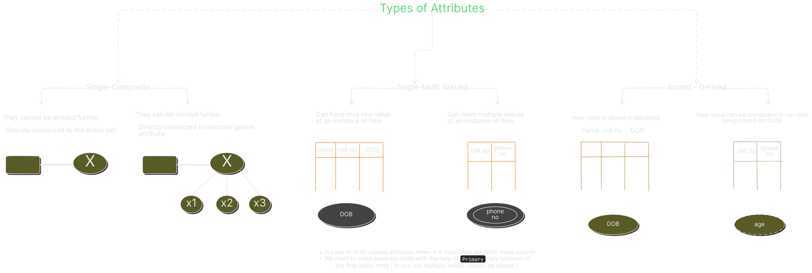
- A relationship can also possible among those entity which lie on single entity or among entities within the same entity sets.
  - These are called **recursive relationships** or **self-referential relationships**
  - It occurs when an entity in an entity set is related to another entity of same set. Hence, represent hierarchical or peer-to-peer relationships within a single type of entity
    ```xml
    Alice (CEO)
    └─ Bob (Manager)
       ├─ Charlie (Developer)
       └─ Diana (Developer)
    ```

## Relationship

- It is an association between two or more entites of same or different entity set
- No representation in ER Diagram as it is an instance or data
- In relational model, reprsented by either using a row in a table
  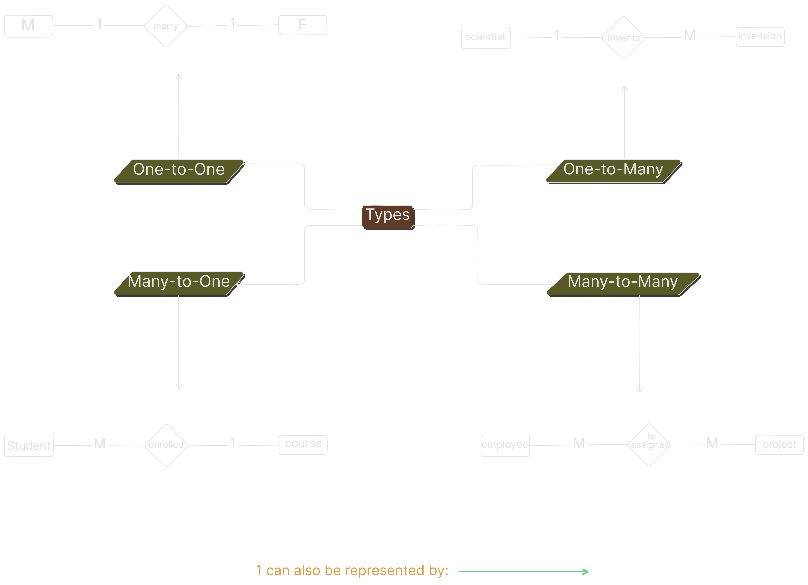
- `1:1` - At most have 1 relation and its not necessary to participate
- `1:M` & `M:1`: - At most n participation
  
- Every **1:1** is **M:1** and **1:M**

## Relationship set

- A set of similar type of relationship
- Represented using a diamond or rhombus in ER Diagram
- Represnted using a separate table or by separate column (foreign key)
- Every relationship type has three component:
  - Name
  - Degree
  - Carditionally Ratio/ Participation Constrains
- A relationship can also possible among those entity which lie on single entity
  

## Degree of a Relationship Set

- Number of entity set participating in the relationship set
- Mostly these are binary
- **Types**:
  

## Cardinalities / Cardinality Ratio: (MAPPING)

- Expresses the number of entities to which other entity can be related (via a relationship)
- NOTE:
  - In case of one-to-one. One entity relates to at most one entitty of other set. So, it may be possible that some entity do not relate to any one
- **Cardinality Constraint**: Maximum number of relationship instances in which an entity can participate

### Participation Constraints

- It satisfies the maximum and minimum number of relationship instances that each entity can/ must participate in
- **Types**:
  - _Max-Cardinality_: Maximum number of times an entity can occur in relationship
  - _Min-Cardinality_: Minimum number of times an entity can occur in relationship
- _Partial Participation_: When min-cardinality is zero (`c = 0`)
- _Total Participation_: When min-cardinality is greater than zero (`c > 0`)
  

## Functional Dependency

- Relationship b/w two attributes (Primary key & Non-key)
- If we have two set of attributes (alpha, beta) and they are in functional dependecy between them then, through alpha we can find the values of beta
  - We can only get one value of beta for the same value of alpha
    ```
    eg:
      a --> 1
      b --> 2
    ```
    It is many-to-one
  - We can get multiple values of beta for different values of alpha
    ```
    eg:
     a --> 1
     b --> 2
     a --> 5 -->(X)
    ```
    - Here, f(a) = 1 then f(a) can not be equal to 5
    - Its one-to-one
- _Types_:
  

### Question on Functional Dependency

- Find which is not valid dependency:
  
- `NOTE`: when (α --> β)
  - If all α's are unique then we don't need to check as all are correct
  - If all β's are same then we don't need yo check as all are correct

## Armstrong Axiom (CLOSURE)

- Attribute closure/ Closure on attribute set/ closure of attribute set
- It can be defined as a set of attributes which can be functionally determined from it
- Denoted by `F+`
  

### Armstrong Axioms:

These are the basic rules of functional dependencies


- Union and Decomposition are always used in right side of the expression

### Comparing Two Functional Dependencies

1. Calculate closure for both set of attributes
2. Use the Opposite Set for Validation:
   - Compute the closure by referencing dependencies from the opposite set
     - As: Calculate the closure of attributes in F, using G’s dependencies, and vice versa.
3. Repeat the Process for the Other Side:
   - Calculate the closure oof others also
4. Final Comparison:
   - If the closures match in both directions (F using G and G using F), the two sets are equivalent.
   - If one set's closure is a subset or superset of the other, it indicates a dependency relationship between the two sets.


```md
- If F ⊆ G: F’s functional dependencies are a subset of G’s.
- If F ⊇ G: F’s functional dependencies are a superset of G’s.
- If F ≡ G: F and G are equivalent in terms of their functional dependencies.
- If F ≠ G: F and G have different functional dependencies.
```

### Irreducible set of FD(conical Form)

- In the given set of FD, there exist some redundant element, and we need to remove them
- __Redundant__: Their presence and existance don't affect the capability of the Fd
- There are three cases of Redundancies:
  - On the left side of the FD
  - On the right side of the FD
  - Entire set


- Steps:
  - First write separately using Decomposition rule wherever more than 1 attribute is present on the right-hand side
    - Now the possibility of redundancy in right hand side not exist b/c we have decomposed them
  - Calculate the closure of every element on the left hand side
    - There is a catch that you have to do this process twice, on the second go you need to ignore the fd of the first attempted
    - Compare the two:
      - if the closure comes different it says this dependecny is essential
      - if the closure comes same it says this dependecy is redundant and you need to clear it
        - while clearing it you have to neglect it fully also in cases of finding other attributres
    - After that write the rest:
    - Thereafter you only need to check the dependecies of that having more than 1 attribute on the right hand side.
      - this time by calculating the closure of all
      - After that calculating the closure of each separately
        - if the values comes ssame in either on (i.e, in each attribute) with the closure (as a whole). Then this dependency is redundant
- for the same set of fd there exists more than 1 conical form and that depends on order you are performing the operation

## KEYS

- Key is a set of attribute which uniquely identify the row and a tupple in a relationship table
- Key (either single/ set of attribute) must identify the row/ tupple of the database
- **Need**: For the retrival of data from the databse.
- *Key* ≡ *SuperKey*; Its closure always give all the attributes

### Candidate Key

- It is an efficient version of superkey
- A superkey is called a candidate key whose proper sub-set is not a superkey
- It can be multiple is numbers
  
- Every Candidate Key is not a SuperKey but to become a Candidate Key, it should be SuperKey.

### Primary Key

- It is that candidate key which is selected by the administrator as the primary mean to identify tuples
- It's number is only one


## Normalization

- Normalization is a process to remove data-redundancy


- **Redundancy vs Inconsistemcy**:

  - When some data is stored multiple times in a database, called _Redundancy_
  - When the values of these data are different in different places then it's called _Inconsistency_

- _Solve Redundancy_
  - It's easier to gather data in one place than to create separate tables.
  - Make sure to create tables in such a way that each table contains data that is directly related to each other.
    - For example, one table should contain a single idea
  - As one paragraph contains a single idea similarly are table must contain direct and main data about an entity
  - Normalisation (decomposition of tables) of table is done of the basic of functional dependency

### 1 Normal Form

- A table is said to be in a 1 NF, if every cell contain atomic value
- Here, **multi-valued** attribute is not allowed
- For this we need to repeat each value in each column
- When we convert ER Diagram to Relational Model, for every multivalued attribute you should have an independent table
- If there is a relational schema, then the table is said to be in 1NF
- Every column should contain the value of same domain and every column should have different name

### 2 Normal Form

- A table is said to be in **2 NF** if:
  - Must be in 1 NF
  - No Partial Dependency
    
- **Prime Attribute**: Those attribute which are a part of Candidate Key
- **Non-Prime Attribute**: Those attribute which are not a part of Candidate Key
- If an attribute is a part of any one of the CK, said to be prime attribute. Here, C only depends on B (not to prime attribute AB) So, it's partial dependent.
- **Partial Dependency**: When a non-prime attribute instead of depending on the entire CK, it depends only on the part of CK
- In the above diagram , C is non-prime it should depend on whole PK, but it depends only on its part
- _Problem with 2NF_: At run-time if its value become NULL, at that time you cannot calculate C

### Conversion to 2NF

- Make a table that only contains PK and with those attribute who can be calculated using it
  - R1(A B D)
- Make another table with those which are making prime attribute
  - R2(B C)
- Always make a separate table for PK
  - R3(A B C)


### 3 Normal Form

- A table is said to be in 3NF, if there is no **Transitive Dependency** for non-prime attributes as well as it is in the second normal form
- A relation is in 3NF if at least one of the following conditions holds in every non-trivial function dependency `X –> Y`
  - `X` is a super key
  - `Y` is a Prime Attribute (each element of Y is part of some candidate key)
- 3rd normal form do not allow transitive Dependency
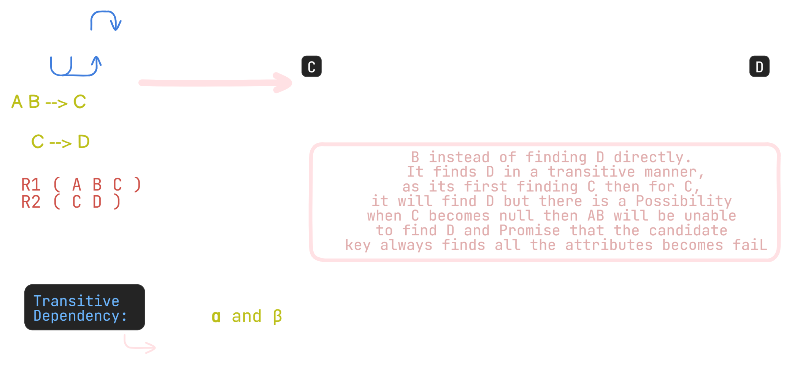

### BCNF(Boyce-Codd Normal Form)
- If there is a dependency from Alpha to beta where Alpha is prime attribute or nonprime attribute and beta is prime attribute in this case we deals with BCNF
-  Rules for BCNF
   -  The table should be in the 3rd Normal Form
   -  `X` should be a `superkey` for every functional dependency (FD) `X−>Y` in a given relation.
- By using BCNF, a database will remove all redundancies based on functional dependencies
- It was developed to address anomalies that 3NF couldn't resolve
- BCNF tables are also 1NF, 2NF, and 3NF
   
- A table can be in 3rd normal form but not in BCNF:
- Sometimes, when we decompose a table, it can happen that some dependencies from the child table do not propagate. This is called a dependency that is not child-preserving. This typically occurs when the table is in 3rd normal form (3NF) or Boyce-Codd normal form (BCNF). Such issues are not possible in 1st normal form (1NF) or 2nd normal form (2NF).
  

### Lossless Join Decomposition || Non-Additive Decomposition:
- If you decompose one table into more than one table during normalization, and when you combine them, you should get the original table back, but that doesn't happen, so decomposition is lossy.
- When you further convert the parent table into child tables, and when you combine them to get the parent table back, it doesn't fully return, and this is what is referred to as lossy decomposition.
- It is a mandatiry property that always holds good
- It guarantees that the extra/ loss row generation problem doesn't occur after decomposition
  
  - Extra tupple or less tupple bith are wrong (no-lossless)
- Important:
  - If the common attribute in both the table is `CK` then there is no _lossy decomposition_
  - All attributes must be present in the child table
  - There must be some kind of common attribute present in both the tables
  - Only common is not the only thing, that common attribute must have unique and distinct values
  
- __dependency Preserving__: When we combine 2 relational tabel then, if the final Functional Dependency will be equal to the Functional Dependency of the parent table


## File Structuring 
- Files can be stored in random or sequential manner in a block and also in sorted or unsorted manner
- Files are stored in secondary memory in three ways:
  - Contigous
  - linked
  - Index( speed fast && no external fegmentation)
    - We generally use __index__ allocation. Here, every index is treated as special node and store address of every block where we store address
- Sometimes some record couldn't get stored in a block then its spanned and unspanned allocation
- A relational is nothinmg but a set of cartesian product
- A relational is itself a set(unordered structure)
- We will store the `I` record in a block only when it is completely coming; otherwise, we will store it separately to avoid wasting memory.

| **Stored Method** | **Unstored Method** |
 --- | --- 
| In manner of a key/ column then other may/ may not be in stored order (Generally stored using key that is mnostly used) | Search is complex (linear search)  |
| Compratively easier access (Binary Search) |  |
| Insertion and deletion is complex than unsorted method | Insertion and deletion is easier |

| **Spanned Mapping** | **Unspanned Mapping** |
| --- | --- |
| No wastage in memory, records can be broken into parts | Only store when we can store whole record in the block |
| Search time is more | Leads to internal fragmentation |
| Less used ( memory - waste :: time - wastage) | Insertion and deletion is easier (more used) |

## Indexing
- For searching a record: we have two things `block` and `record`
- Block search time `>` record in a block search
  - Block Search time = `log n`
- To get faster access, we use index (index-table) similar as book-indexing
- We may apply binary search in case of sorted block 
  - This is also time consuming if the number of blocks is very much
  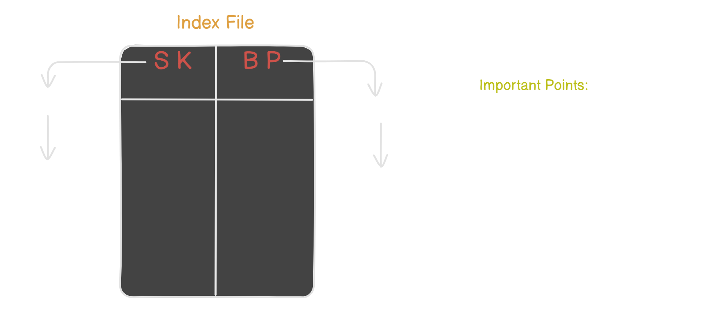
- Sparse Indexing: 
  - It is possible when every record from the main file don't get entry in the index file
  - Only store one `SK` and `BP` of a record block
- Dense Indexing:
  - It is possible when every record from the main file get entry in the index file
  - It is possible in un-sorted file
  - When we store whole `SK` and `BP's` of entire record block
- Indexing does not affect the structure or content of the main file
- It is an optional Method
- It's always a secondary mean to identify tupple

### Types of Indexing
1. Primary Indexing
2. Cluster Indexing
3. Secondary Indexing
4. Multi-Level Indexing

### Primary Indexing
- Possible only when the main file is sorted ( sorted according to Primary Key)
- Example of Sparse Indexing
- The anchor attribute used in the index file for searching should be a key attribute because it points to the primary key of the main file.
- Number of enteries in index file is equal to the number of blocks acquired by the main file
- Number of access = `log n + 1` block

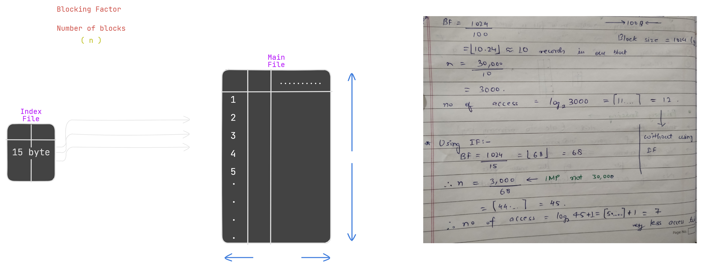

### Clustering Indexing
- Main file is stored on some non-primary key attribute 
- repeated value can be found
- There will be one entry for each unique value of non-key attribute
- If number of blocks acquired by index file is `n`, then block access = `log n + 1`
- It can be sparsed or densed

### Secondary Indexing
- It can be done on keys as well as non-key attribute
- Dense Indexing
- No. of blocks access  >= `log n + 1`
- No. of entry in IF = no. of entry in main file
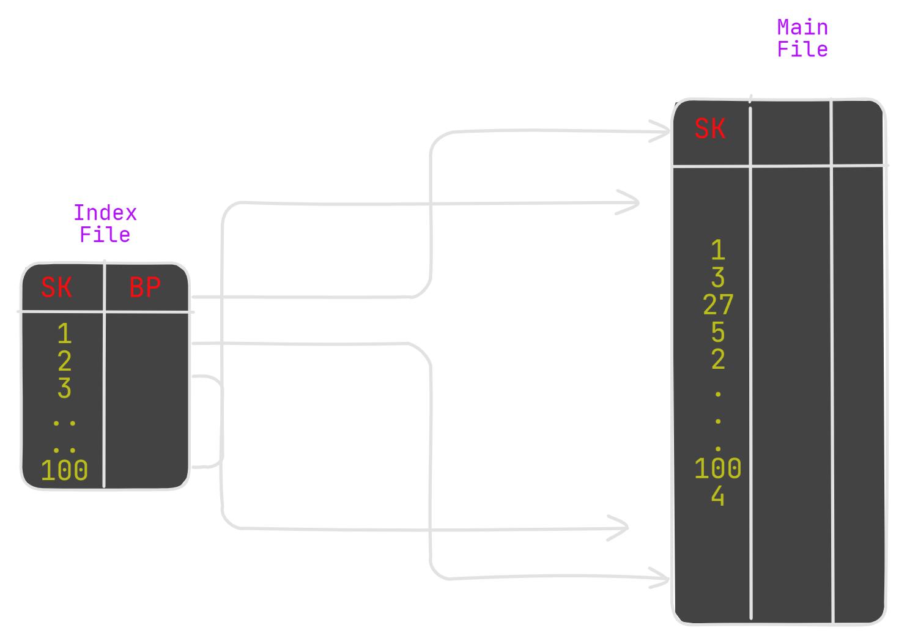


## Query Language
- Language in which user request some information from database

| **Procedural Query Language** | **non-procedural Query Language** |
 --- | --- 
| User gives process and operations to produce result | User gives only desired information without giving process to extract it |
| User tells what data to be retrieved and how |  |

  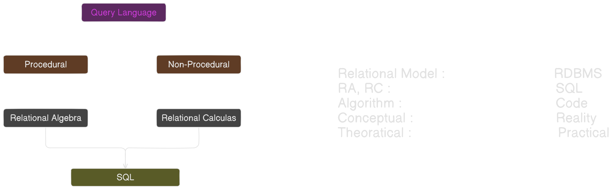
- We use RDBMS (practical implementation of relational model) and SQL is used to write queries on it
- Relational algebra and relational calculas arew mathematical system/ query language used on Relational Model

### Relational Algerbra
- It is similar to  mathematics [ operations (basic + derived) ; operands (table)]
- Take one or two relations (tables) as input, generate a single _output_ table (relations) with __no-name__
- It supports no duplicacy as based om set-theory
- Here, use of `English` keywords are avoided
- **Basic or Fundamental Operations**
  - They are capable of writing any kind of queries
  - These are sometimes called Functinally complete
  - They are as follows:
    1. `Select`: ( σ )
    2. `Project`: ( π )
    3. `Union`: ( ∪ )
    4. `Set Difference`: ( − )
    5. `Cartesian Product`: ( × )
    6. `Rename`: ( ρ )
- **Derived Operators**
  - These are used to make the queries efficient
    - They are as follows:
      1. `Natural Join`: ( ⋈ )
      2. `Intersection`: ( ∩ )
         * ( X ∩ Y) = X - (X - Y) 
      3. `Division`: ( ÷ or / )

#### Select ( σ )
- A unary-fundamental oprator, works on one table at a time
- Main idea of select is to find `rows || tuples` in a relation (Horizintal Search) 
- Its function is same as where clause of SQL
- Syntax: σ$_{condition/predicate}$(table name)
- minimum row selected = 0
- maximum row selected = all

- Nesting: 
  - σ$_{condition}$(σ$_{condition}$(table name))
  - σ$_{condition}$ ^/V σ$_{condition}$(table name)

#### Project ( π )
- It used to extract specified column data
- It is an unary and fundamental operator
- Synta: π$_{column name}$(table name)
- Nesting: 
  - π$_{name1, name2}$(table name)
- When using the `σ` as well as `π` operators together : always `σ` is first then `π`
- To select all column [ $_{select}$* ] || (branch) || (table name)
- Example:
  - Find names of all the students from CS branch
    - σ$_{branch = 'CS'}$(π$_{name}$(student)) ---> `wrong`
    - π$_{name}$( σ$_{branch = 'CS'}$(student)) ---> `correct`

## Transaction

- These are the set of operations used to perform logical unit of work
- Basically a set of logically related instructions. It contains a group of tasks/ instructions. All the instructions of a transaction must be performed
- These are the programs in terms of DBMS
- If an interrupt happens in between the instruction-set then we need to *undo* all instructions happend. It's called **roll-back**
- It deals with the maintainance of database
- Transactions are always atomic in nature

### ACID Properties:
- These properties helps to maintain the consistency of transaction 
  - **Atomicity**: 
    - It means either all transaction become successful or none
    - Transactions cannot occur partially
    - *Transaction Management Component* ensures the atomicity of DBMS
    - It has two major componennt:
      - *Abort*: If a transaction is abort, all changes made are not visible
      - *Commit*: If a transaction is commited, all changes made are visible
  - **Consistency**:
    - It ensures bringing database from one consistent state to another consistent state
    - Its execution will leave the database in either its prior stable state/ new stable state
    - No component takes care of this, it will always hold true if all the three-properties are satisfied
  - **Isolation**:
    - it ensures tthat instructions is isolated from other  transaction
    - Data used at time of execution of a transaction cannot be used by second transaction until first one is completed
    - *Concurrency Control System* takes care of it
  - **Durability**:
    - It means once a transaction has been commted it will remain so, even in the event of errors/ power loss
    - *Recovery Subsystem* takes care of it

### Transaction State:
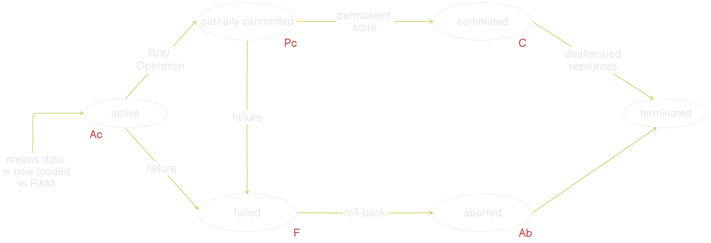
  - Ac: First state of every transaction (RAM)
  - Pc: Transaction executes its final step, but data is not saved to the database
  - C: All operations are executed successfully, all the effects are permanently saved in database
  - F: If any checks of dbms fails
  - Ab: If failed state is achieved, then the recover system will make sure thar database is in its previous stable state

- After aborting, database recovery module will choose: 
  - Restart the transaction
  - Kill the transaction
  - Free all the occupied resources

### Concurrency:
- When more than one transaction run at a time
- Advantage:
  - Waiting time dectreases
  - Response time dectreases
  - Resource utilization is better
  - Efficiecy increases
- Disadvantages:
  - In case of concurrency, management is complex
  - Uncommited data 
  - Temporary update problem
  - Phantom read problem 

### Dirty Read Problem

- It is also called *Uncommited Read* as well as *Reasd After Write* 
- When a transaction reads data that is being modified by another transaction (i.e, running concurrently and not yet committed)
   
  - Here, Reader should commit first
- To overcome any failure and probllem, dirty reader shouuld commit its changes after commitment of the transaction that it is using 

### Unrepeatable Read
- It occurs when two/ more read operation of some transaction read different values of same variable 
  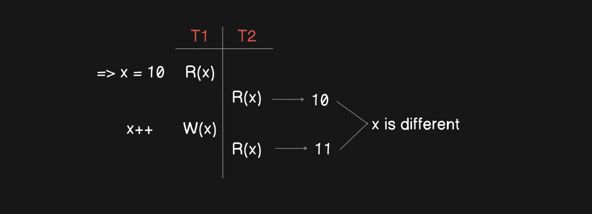

### Phantom Read Problem
- When a transaction reads a variable once but when it tries to read it again an eerror happens saying that the variable doesn't  exist anywhere
  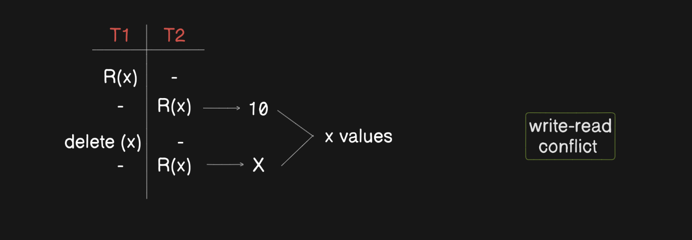

### Lost update Problem
- It happens at the time of Write-Write Conflict
- When two different transaction, try to update the same column on the same row within same time
  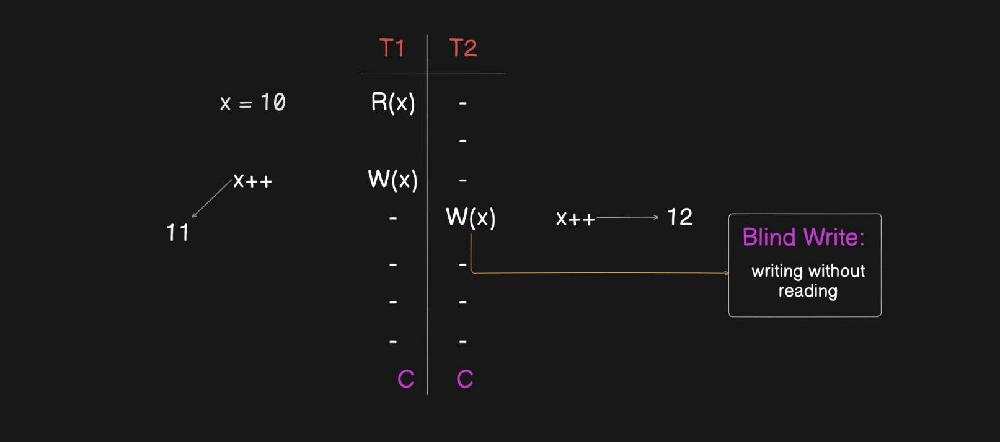

### Serial and Non-Serial Scheduling

- Schedule: 
  - A series of operations from one transaction to another transaction 
  - It helps to preserve order if operations
  - Types:
    - Serial
    - Non-Serial
    - Serializable
- Serial: 
  - A type of schedule where one transaction is executed completely befoe starting the another transaction 
    
- Non-Serial:
  - Interleaving of operations (switching b/w different transactions)
     
- Serailizable:
  - Seriazability of schedules is used to find non-serial schedules that allow the transaction to execute concurrently without interleaving one-another
  - If non-serialized schedule results same as serialized schedule then it is called serializable

### Conflict Serializability
- A schedule is conflict serializable if after swapping of non-conflicting operations, it can transform into serial schedule
   

### View Serializability
- In case of CS, if there is a loop, then the transaction may/ may not be serializable. So, we cheeck view serializable

- If our non-serial schedule is view equivalent to some other serial schedule. Then the schedule is called view serializable
- How to check (VS)
  - Initial read should be same
  - Final read should be same
  - Mid-sequence should be same as well
  
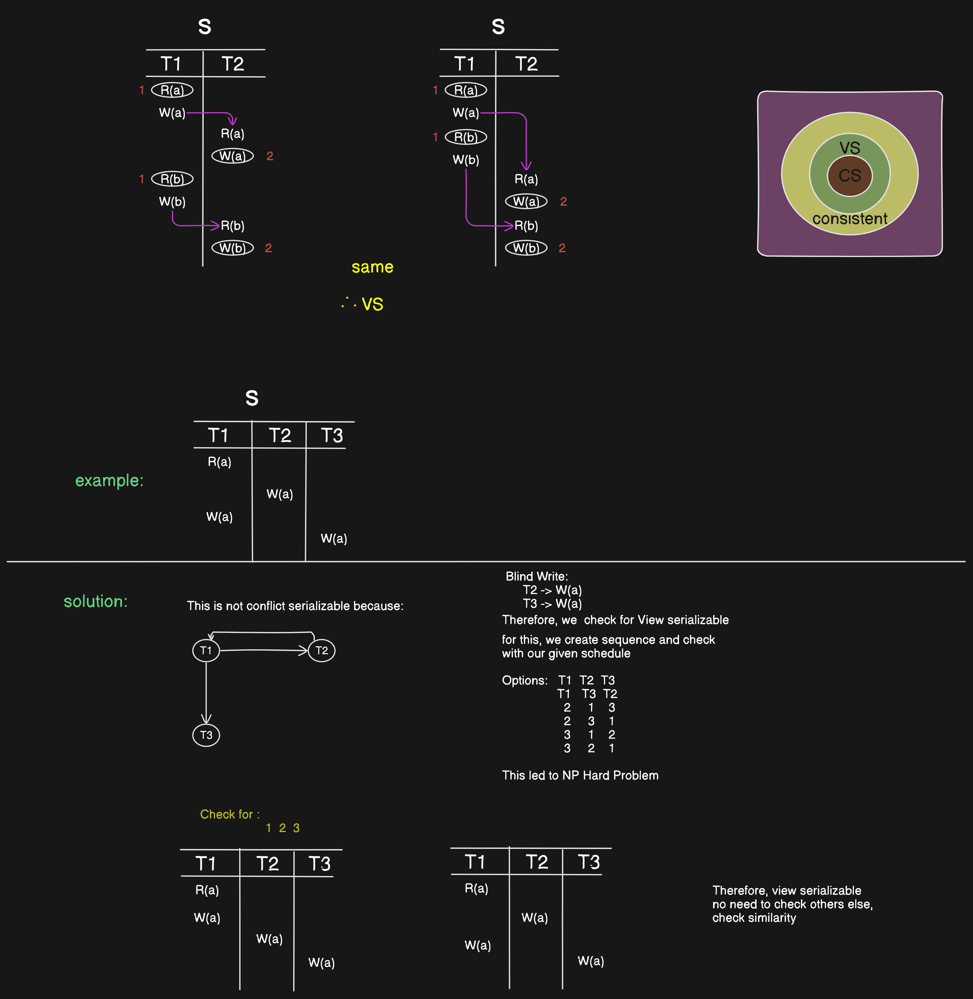

### Recoverability of Schedule
- Schedules are normally of three types namely: Cascadless, Recoverable and Non-Recoverable
- Schedules in which transactions commit only after all the transactions that made dirty read are committed.
- Basically, the Dirty-Read retransaction should commit after original read transactions
  - Check:
    - It's no dirty read then always recoverable as there will be no dependency
    - Dirty-Read transaction shouldn't commit first
  - Recoverability is necessary
- *Recoverable*: If during non-conflicting consistent transaction, a failure happens and results in unwanted change in database. Then, if we can recover back out data is called recoverable schedule.
- *Non-Recoverable*: vice versa
- *Cascading Schedules*: If in a schedule failure of one transaction causes several other dependent transaction to rollback or abort then schedule is called cascading schedules. It simply leads to the wastage of CPU
- Strict Schedules: A transaction is neither allowed to read nor write a data item until the last transaction that has written it is committed or aborted.
- It allows read or write only on committed data

### Concurrency Control Techniques:
- It is a procedure of managing simultaneous operations without conflicting with each other 
- We will study protocols that generate schedules which satisfy properties of consistent schedules especially conflict serializability 
- Actual problem is different transaction try to access data at the same time 
- Approaches to cs 
  - Time stamping protocol 
  - Lock based protocol 
    - 2PL 
    - Graph based 
  - Valid protocol 
- Goals: Concurrency, properties, time, logic

### Time stamping ordering protocol:
- Used to order transactions based on their timestamps. Order is in ascending mode of transaction creation.
- To determine time-stamp, this protocol uses time or logic counter 
- log K based protocol is used to manage the order between conflicting pairs of transactions I
- It also maintains timestamps of last rate or write operations 
- Basic idea is to decide order of transactions before it enters into the system 
- For stamping, we use system-call: (Two time stamps are possible)
  - Time-stamp with transaction: Unique for a transaction and usually the time at which transaction enters the system
  - Time-stamp with data items: for a data item 'Q', protocol maintains two timestamps:
    - W-time stamp [W(Q)]: it is the largest time stamp of any transaction that executed right operation successfully (Basically the latest transactions that successfully used write operations on that data) 
    - R-time stamp [R(Q)]: similarly 
  - Hence the juniors should be given preference
  - 
- Properties achieved using T.S.P:
- conflict serializability 
- view serializability 
- possibility of dirty read 
- no restrictions on commit 
- non recoverable (possible) and cascading rollbacks (possible)
- no idea of deadlock (coz no wait only yes or no) 
- May suffer from starvation (coz rollback due to timestamp) and relatively slow

### Thomas Write Rule
- It guarantee serializability order protocol
- If younger has performed rate or right then older should not perform rate and write on that value as it violates this realizability and may lead to inconvenient and inconsistent database
- Rules:
  - Transaction Ti issues Read(A) operation:
    - if WTS(A) > TS(Ti), rollback Ti
    - otherwise execute R(A) operation
      - set RTS(A) = Max { RTS(A), TS(Ti)}
  - Transaction Ti issues Write(A) operation:
    - if RTS(A) > TS(Ti), rollback Ti
    - if WTS(A) > TS(Ti), rollback Ti
    - otherwise execute W(A) operation ans set WTS(A) = TS(Ti)

### Lock Based Protocol
- To achieve consistency isolation is the most important idea locking is a simple idea to achieve isolation that is first optional lock on a data item performed desired operation and then unlock it 
- Ways to lock: 
  - Shared mode: Denoted by lock-S(Q), transaction can perform read operation and any other transaction can also obtain same data at the same time (read only)
  - Exclusive mode: Denoted by lock-X(Q), transaction can perform both read and write operation, any other transaction cannot obtain either shared/ exclusive mode lock
  
  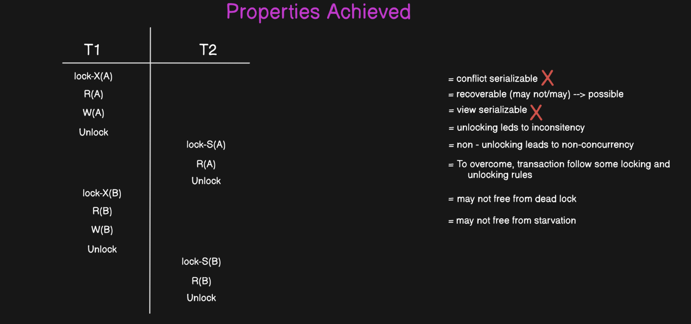


### 2PL (2 Phase Locking): 
- Each transaction has 2 phases: shrinking and growing
    
- In growing phase, transaction can only obtain locks but cannot release any lock (ACQUIRE)
- In shrinking phase, transaction can only release locks but cannot acquire any lock (RELEASE)
- transaction can perform rate or write in both the phases
- Order of serializability = order of transactions in reaching lock point
- May generate unrecoverable schedules and cascading rollbacks
- Do not ensure freedom from deadlock and starvation
  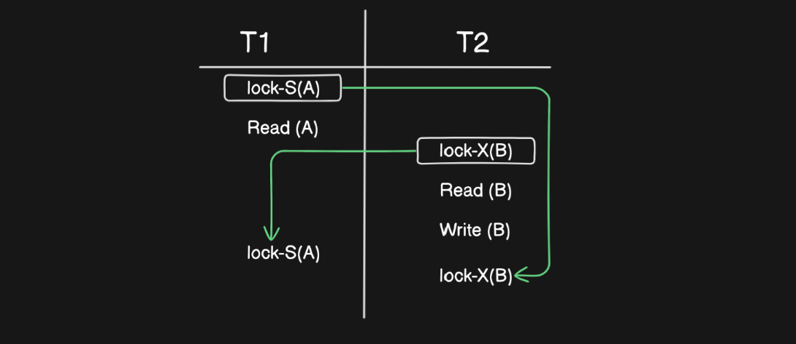

### Conservative or Consecutive or Static 2PL
- Basic idea is to give all the necessary logs to transaction before starting other transactions hence no growing phase transaction first acquires all locks and directly start from lock point starvation can be there
- If all locks are not available transaction must release the acquired lock so far and wait
- We should have knowledge of all the data items we want in advance
- no-dead lock
- conflict-serializability and view-serializability
- non-recoverable and cascading rollbacks - possible 
  - dirty read is there
  
  
### Rigrous 2PL:
  
- An improvement over 2PL where try to ensure recoverability and cascading rollbacks
- It requires that all locks must be held until transaction commit that is no shrinking phase
- ensures:
  - conflict and views serializability 
  - recoverability and cascading rollbacks 
- suffers:
  - Deadlock and efficiencyDeadlock and efficiency

### Strict 2PL 
- Better than Rigrous
- In the shrinking phase unlocking of exclusive locks are not allowed but unlocking of shared locks can be done 
- All the properties are same as rigorous but provide better concurrency and efficiency is also more
- Since we are only unlocking shared locks (only read) then there cannot be any dirty read with the transition
  

### Graph Based Protocol
- We need some additional information for this protocol
- There are various models that can give us additional information each differing in the amount of information provided
- One idea is to have prior knowledge about the order in which data items will be accessed
- We impose partial ordering on data items set: D = {d1, d2.....dn} if di < dj then dj should be accessed after di
- Partial order may be viewed as directed acyclic graph called database graphs
- Restrictions on DAG:
  - Will only study graph that are rooted
  - Will only use exclusive lock mode

### Tree protocol
- Each data items can be logged by following rules
  - First lock on T I can be done by any data items
  - After that we can only locked child of TI
  - Data items can be unlocked any times
  - Data items once unlocked cannot be locked again
Example:
  

### Properties achieved
- View-serialization and conflict-serialization due to directional flow 
- no-dead lock
- no ensurity of recioverability and cascadeless (dirty read)
- Early unlocking is possible shorter waiting time and less concurrency
- A transaction may need to lock data items that it will not access so led to decrease concurrency and increase the waiting time
- A transaction must know what data items are to be accessed
- Recoverability and cascade lessness can be provided by not unlocking before commit

### Deadlock handling
- Here, waiting time is infinite
- System must have proper methods to deal with it else:
  - In real time system it may lead to life and money
  - will reduce resourceswill reduce resources utilisation and increase efficiency
- 2 principles used to deal with it: 
  - Prevention: system will never enter in the deadlock state
  - Detection and recovery: allows system to enter into deadlock and try to recover it

### Prevention 
- lock all necessary data before execution start: no hold and wait
- no cycle wait: Improve ordering of data items and locks should follow same approach or ordering
- No-preemption: Wait and die
  - if Ti < Tj  and i wants Q then Ti should wait
  - if Tj > Ti then Ti = rollback  
- Preemption: wound-wait
  - if Ti < Tj  and i wants Q, j rollback
  - if Tj > Ti then Ti should wait
