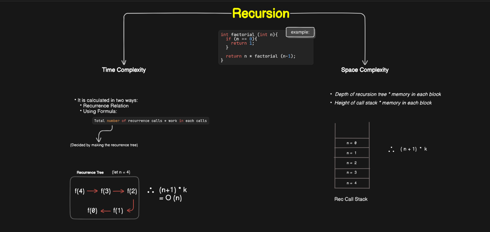

## Data Structures and Algorithm

### Introduction

#### **`Data Structures`**:
- Data structures are fundamental building blocks in which data are arranged so that data items can be used efficiently in memory
- Examples: Array, Stack, Linked List, etc

#### **`Algorithm`**:
- Sequence of steps on data using efficient data structures to solve a given problem
- Examples: sorting an array.

#### **`Other Terminology`**:

1. *Database* - Collection of information in permanent storage for faster retrival and updation. Examples- MySql, MongoDB, etc.
2. *Data Warehouse* - Management of huge data of legacy data( the data we keep at a different place from our fresh data in the database to make the process of retrieval and updation fast) for better analysis.
3. *Big Data* - Analysis of too large or complex data, which cannot be dealt with the traditional data processing applications.

#### `Memory Layout of C Program`:


#### `Time Complexity and Big-O Notation`:


#### *`Asymptotic Notations`*
- Asymptotic notation gives us an idea about how good a given algorithm is compared to some other algorithm.
- There are three types of asymptotic notstions:
  1. Big-O notation (`O`)
  2. Big omega notation (`Ω`)
  3. Big theta notation (`θ`) --> "Widely Used"

#### **`Big-O Notation (O)`**:
- Describe an asymptotic upper bond.
- Mathematically, if `f(n)` describes the running time of an algorithm; `f(n)` is `O(g(n))` if and only if there exist positive constants c and n° such that:
```htXMLml
0 ≤ f(n) ≤ c g(n)        for all n ≥ n°. 
```
- Here, `n` is the input size, and `g(n)` is any complexity function.
- If a function is `O(n)`, it is automatically `O(n^2)` as well! Because it satisfies the equation given above.


#### **`Big Omega Notation (Ω)`**:
- Describe an asymptotic lower bond.
- Let `f(n)` describes the running time of an algorithm; `f(n)` is `Ω(g(n))` if and only if there exist positive constants `c` and `n°` such that:
```html
0 ≤ c g(n) ≤ f(n)        for all n ≥ n°.  
```
- If a function is `Ω(n^2)` it is automatically `Ω(n)` as well since it satisfies the above equation.


#### **`Big theta notation (θ)`**:
- Let `f(n)` define the running time of an algorithm.
- `f(n)` is said to be **θ (g(n))** if `f(n)` is `O(g(n))` and `f(n)` is `Ω(g(n))` both. 
```html
    0 ≤ f(n) ≤ c1 g(n)      ∀    n ≥ no.      --------(i)
    0 ≤ c2 g(n) ≤ f(n)      ∀    n ≥ no.      --------(ii)  
    
              On Combining both the equation:

    0  ≤ c2 g(n)  ≤  f(n) ≤ c1 g(n)      ∀    n ≥ no.  

```

- Big theta provides a better picture of a given algorithm, most of the interviewers expect you to provide an answer in terms of Big Theta when they say **Order Of** as it provides the exact posibility of the function to lie at that value. We generally use Big Oh and Big Omega when tthe exact posibility of the gfunction is not known to us


#### Properties of Asymptotic Notations:
- If `f(n)` is `O(g(n))` then that of `a*f(n)` is same
- A function is itself `O(f(n))`
  - Same function is the upper as well as the lower bound of the function
- If `f(n)` is `O(g(n))` and `g(n)` is `O(h(n))`
- If `f(n)` is `θ(g(n))` then `g(n)` is `θ(f(n))`
- If `f(n)` is `O(g(n))` then `g(n)` is `Ω(f(n))`
- If `f(n) = O(g(n))`  and `f(n) = Ω(g(n))`. Therefore, `f(n) = θ(g(n))`
- If `f(n) = O (g(n))` & `d(n) = O (e(n))`. Then:
```xml
f(n) + d(n) = O (max(g(n),e(n)))
f(n) * d(n) = O (g(n)*e(n))
```

- For the comparision of two functions we use the mathematical concept `log`: Apply log on both the functions.

#### Best Case, Worst Case and Average Case Analysis of an Algorithm:

1. **Best Case**: The scenario in which the algorithm performs optimally, achieving the lowest possible time    complexity or space complexity for a given input size
2. **Worst Case**: The scenario of an algorithm in which the algorithm exhibits the highest time complexity or resource usage
   - Worst Case can also varies from maximum to minimum. As, worst case for binary search depends on the height of the binary search tree, and height of the binary search tree depends from minimum as `log n` and maximum as `n`.
      - So, the worst case flactuates from: `O(log n)` to `O(n)`
3. **Average Case**: Represents its expected performance when given random inputs from the problem domain. It involves analyzing the algorithm's behavior over a range of possible inputs, considering their probability distribution, and calculating the average performance based on this distribution. This analysis helps in understanding how the algorithm typically behaves in real-world scenarios and guides decision-making in algorithm selection and design.

#### Analysis of an Algorithm:
- We are given a sorted array `arr[]={1, 7, 18, 28, 50, 180}`. Here, we have to search a given number and report whether it’s present in the array or not. So, we got two situations here: 
  - **Algorithm 1**: Start from the first element until an element greater than or equal to the number to be searched is found.
  - **Algorithm 2**: Check whether the first or last element is equal to the number. If not, find the number between these two elements (center of the array); if the center element is greater than the number to be searched, repeat the process for the first half else, repeat for the second half until the number is found. And this way, keep dividing your search space, making it faster to search.

`Analyzing Algorithm 1`: (**Linear Search**)
- Suppose we find out the element at the first element of the array. Therefore, we only made one comparison which is obviously constant for any size of the array.
  - *Best case complexity* = `O(1)`
- Suppose, the element will be at the last position. Therefore, our program made **`n`** comparision.
  - *Worst case complexity* = `0(n)`
- *Average case complexity* = `Σ(list of all possible cases)/(total no. of cases)`

`Analyzing Algorithm 2`: (**Binary Search**)
- Suppose, the first element will be the only element that gets compared. Hence, a constant time.
  - *Best case complexity* = `O(1)`
- If not, then we will have to keep dividing the array into halves until we get a single  element.
  -  Therefore, time taken = `n + n/2 +n/4 + ....... + 1` = `logn` with base `2`
  - *Worst case complexity* = `O(log n)`

#### `Space Complexity`:
- Time is not the only thing we worry about while analyzing algorithms. Space is equally important.
- Creating an array of size n (size of the input) → `O(n)` Space  
- If a function calls itself recursively n times, its space complexity is `O(n)`.

####  Why we can't calculate complexity in seconds when dealing with time complexities ?
- Not everyone’s computer is equally powerful. So, We just measure the growth of time with an increase in the input size.
- Asymptotic analysis is the measure of how time (runtime) grows with input.


### Abstract Data Types:
- Provide a high-level description of data and the operations that can be performed on that data, without specifying the implementation details
- It is a way of classifying data structures by providing a minimal expected interface and some set of methods
- Set of operations that can be performed on the data, along with their properties and constraints, but they do not dictate how these operations are implemented.
- ADTs serve as a blueprint or a template for creating concrete data structures. They encapsulate the data and operations associated with it, hiding the implementation details from the user.


```c
// example on ADT-Array:

#include<stdio.h>
#include<stdlib.h>

struct myArray
{
    int total_size;
    int used_size;
    int *ptr;
};

void createArray(struct myArray * a, int tSize, int uSize){
    // (*a).total_size = tSize;
    // (*a).used_size = uSize;
    // (*a).ptr = (int *)malloc(tSize * sizeof(int));

    a->total_size = tSize;
    a->used_size = uSize;
    a->ptr = (int *)malloc(tSize * sizeof(int));
}

void show(struct myArray *a){
    for (int i = 0; i < a->used_size; i++)
    {
        printf("%d\n", (a->ptr)[i]);
    }
}

void setVal(struct myArray *a){
    int n;
    for (int i = 0; i < a->used_size; i++)
    {
        printf("Enter element %d", i);
        scanf("%d", &n);
        (a->ptr)[i] = n;
    }
    
}

int main(){
    struct myArray marks;
    createArray(&marks, 10, 2);
    printf("We are running setVal now\n");
    setVal(&marks);

    printf("We are running show now\n");
    show(&marks);

    return 0;
}
```

### Array:
- Collection of more than one element/data element of same data type
- Address are always in hexadecimal form
- These are linera structures where contiguos memory allocation takes place
- `BS + i * (size of datatype)` --> Formula to calculate the address of element in 1D-Array
- Random access takes constant time in Array's
- Size of array:
  >`sizeof`(array) -> this will give the toatl size of the array in bytes
  - Example: 
    ```cpp
     int marks[5];
     sizeof(marks) = 20 bytes (4*5)
    ``` 
  - To calculate the actual size:
    ```cpp
     sizeof(array)/sizeof(datatype);
     size = sizeof(marks)/sizeof(int);
          = 5 
    ```
- **Drawback**:
  - Cannot change the size of an array at the run time 
  - Wastage of size.
  - Array's don't have a bound checking property


#### Operations on Array in Data Structure:
1. Traversal: Process of visiting and accessing each element of an array at exactly one
2. Insertion: Insertion in an array involves adding a new element to the array at a specified position.
3. Deletion: Remove an element from the array at a specified position.
4. Searching: Finding the position of a specific element within the array.
5. Sorting: arranging the elements of the array in a specific order, such as numerical or lexicographical order


```c
// Important Concepts regarding Array
    
//  1.
  int a[] = {6, 2, 1, 5, 3};
  printf("%p",a);               // p is used to print the base address of an array

//  2.
  int b = 10;
  int *p;                       // p = &b 
  // p = b --------------------------------------> wrong

//  3.
  int *q;
  // q = a --------------------------------------> correct
  // because, array name always contain the base address of a

```

- An array is a fundamental data structure in programming that stores a collection of items of the same data type under a single name
- Also called subscript variable

- ```c
  int main()
  {
    int a[100]; ---> // No. of variables
  }
  ```
  - All have same name "a" but index no. is different 0, 1, 2, 3, ..... 99
  - Accessing way of first array
    - `int a[1000]` ---> index number
    - `int a[0]` ---> index number
  - To put 45 in `a[4]`:
    - `a[4] = 45`;
  - `a[ ]` --> error
  - `a[5]` --> is not an error where 5 is no. of varibales consumes continous memory
  - Ways to assighn value:
    - `int a[5] = {9, 6, 8, 9, 0, 2};`
    - `int a[ ] = {9, 6, 8, 9, 0, 2};`
    - `int a[5] = {9, 6};` --> other values is 0
  - `int a[5] = {9, 6, 8, 9, 0, 2, 3, 45, 90};` ---> if we take values gather than assign, it will show error
- Drawbacks:
  - **Fixed size**: Resizing can be complex or impossible.
  - **Limited data type**: Stores only elements of the same type.

```c
int a[10], i, sum;
float avg;

  pritf("Enter 10 Numbers\n");
    for(i=0; i<9; i++)
    {
      scanf("%d", &a[i]); // &a[i] --> address of index number
    }
    for(i=0; i<9; i++)
    {
     sum = sum + a[i];
    }

  avg = sum/100;
  printf("Average is %f", avg);
```

---

### `2-Dimensional Arrays`:

- No. of variables is "6", This means 1st array will get 3 & 2ns Array will get 3
- Called array of arrays


```c
int A[3][3], B[3][3], C[3][3], i, j;

printf("Enter 9 nos. for first matrix\n");
for( i=0; i<=2; i++)
  for( j=0; j<=2; j++)
  {
    scanf("%d",&A[i][j]);
  }
printf("Enter 9 nos. for second matrix\n");
for( i=0; i<=2; i++)
  for( j=0; j<=2; j++)
  {
    scanf("%d",&B[i][j]);
  }

for( i=0; i<=2; i++)
  for( j=0; j<=2; j++)
  {
    C[i][j] = A[i][j] + B[i][j];
    printf("%d",C[i][j]);
  }
  printf("\n");
```
## Vectors
- It is an STL(Standarad Template Library) contanier
- **Syntax**:
  ```cpp
  vector<int> vec; // size = 0
  vector<int> vec = (1, 2, 3);
  vector<int> vec(3, 0); // 3 represents the size of vector and 0 represents the initilaise value at each indices 
  ``` 
- In case of vectors we use `for-each` loop:
  ```cpp
  vector<char> vec = {'a', 'b', 'c', 'd', 'e'};
  for(char val : vec){
    cout << val << endl;
  }
  // val is here called iterator
  // we always create the iterator with the same data-type as of vector
  // Unlike arrays in case of for loop which was storing the index values, here the iterator stores the exact values not its index values
  ```

### Vector Functions:
1. `size`: Used to tell the size of vector
2. `push_back`: Used to pushe the element at the back
3. `pop_back`: Used to pop the last element of vector
4. `front`: Used to print the first element of vector
5. `back`: Used to print the last element of vector
6. `at`: Used to print the specific position of vector
```cpp
vector<int> vec;
cout << "Size of the vector is: " << vec.size(); // 0
vec.push_back(25); // pushes 25 from the back
vec.push_back(35); // pushes 35 from the back
vec.push_back(45); // pushes 45 from the back
vec.push_back(55); // pushes 55 from the back
cout << "Size of the vector is: " << vec.size(); // 4
vec.pop_bak(); // This doesn't  require argument
cout << vec.front(); // 25
cout << vec.back();  // 55
cout << vec.at(2);   // 45
```

- How **vectors** are created inside the memory:
  

## Sub-Array

- Sub-Array are the continous part of an array
- If an array contains __n__ number of elements then total number of possible sub-arrays: `n(n+1)/2`
  
- For printing all the possible sub-arrays we need a starting index and an ending index upto which it'll print
  ```cpp
  int n = 5;
     int arr[5] = {1, 2, 3, 4, 5};
     int st, end;

     for (st = 0; st < n; st++)
     {
        for (end = st; end < n; end++)
        {
           for (int i = st; i <= end; i++)
           {
              std::cout << arr[i];
           }
           std::cout << " ";
        }
        std::cout << endl;
     }
  ```

### Kadanes's Algorithm
- Principle: We should not add a big negative number to get a positive value
- We need to reset the sum of subarray to `0` if its value becomes negative
```cpp
int maxSubArray(vector<int> &nums)
{
    int max_sum = INT_MIN;
    int array_sum = 0;

    for (int val : nums)
    {
        array_sum += val;
        max_sum = max(array_sum, max_sum);

        if (array_sum < 0)
        {
            array_sum = 0;
        }
    }
    return max_sum;
};
```
- Steps:
1. Initialization of max_sum:
- I have initialized max_sum with `INT_MIN` (the smallest possible value) to ensure it can accommodate any sum.
- __Principle__: Start with the smallest possible value so that any sum from the array will be larger.
2. Initialization of array_sum:
- I have initialized array_sum as 0 to begin the accumulation of the current subarray sum.
- __Principle__: Start from zero, and reset when the sum turns negative because adding a negative sum would decrease the overall result.
3. Update max_sum:
- I updated max_sum to be the maximum array_sum and max_sum during each iteration.
- __Principle__: Always track the largest sum encountered so far.
4. Reset array_sum when it becomes negative:
- The reset array_sum to 0 when it becomes negative.
- __Principle__: A negative sum doesn't help form a larger subarray sum, so it's better to start fresh from the next element.

### Moore's Voting Algorithm
#### eg: `1 2 2 1 1`




### Pow(X,N) Power exponential Problem


### Buy and Sell Stock Problem


### Binary Search
- Binary Search is applied only on monotonic functions (where values will be either in asceding or descending)
- 


### Linked list
- 