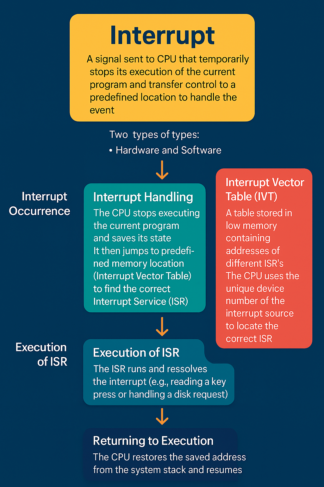

## Points

#### Services Provided by OS
- User Interface 
  - Command-Line Interface (simply text commands)
  - Batch Interface (commands + directives)
  - Graphical-Uder Interface (what we use)
- Program Execution
- I/O Operation
- File System Manipulation
- Communication
- Error Detection
- Resource Allocation
- Accounting
- Protection and Security

- Command Interpreter works in two ways
  - Conatins the code to execute (it itself call the appropriate system call)
  - Implements most commands through system programs (it just identify the file to be loaded in the memory to execute). eg: UNIX

- First GUI appeard on `Xerox Alto` computer in `1973`

## Interrupt:

## Dual-Mode Operation:

- Two separate modes of operation: `user mode`  and `kernel mode` (supervision mode / system mode / privileged mode). A bit called the `mobile bit`, is added to the hardware of the computer to indicate the current mode: kernel (`0`) and user (`1`). 

- Electronic devices may be volatile or non-volatile.
  - Some contain a hidden magnetic hard disk and a battery for backup power (volatile)
  - `Flash Memory` are slower than `DRAM` but needs no power to retain its content
  - `NVRAM` is faster than `DRAM` but has a limited duration in which it is non-volatile (DRAM + Battery backup)

- A `trap` is a software-generated interrupt caused either by an error or a specific request from the user program that an operating system service be performed

### Timer in OS
- A timer is a hardware component that generates an interrupt to the CPU after a specified time interval.
- It is implemented in two types:
  1.  Fixed and Variable period
  2.  Clock and Counter Mechanism: 
      - Clock ticks at fixed rate
      - Counter is decremented with each tick (if counter < 0: OS terminates the program)
      - Interrupt occurs when counter reaches 0
-  Modifying timmer is a privilaged operation; only kernel mode can change timer setting
- How it works?
  - Timer is set by OS before passing control to a user program
  - When the timer expires:
    - Interrupt occurs and the control returns to OS
- Why needed?
  - To ensure OS maintains control over CPU
  - To prevent user program from:
    - Running indefinetly (infinite loops)
    - Consuming CPU time unfairly

### System Call & API

### Process Control and System Calls:
#### Program Termination:
1. Normal Transmition: Program finishes execution successfully
2. Abnnormal Transmition: Program crashes due to an error (e.g., divide by zero).
   -  On abnormal termination, OS may create a `memory dump` for debugging
   - A debugger uses the dump to analyze and fix the bug