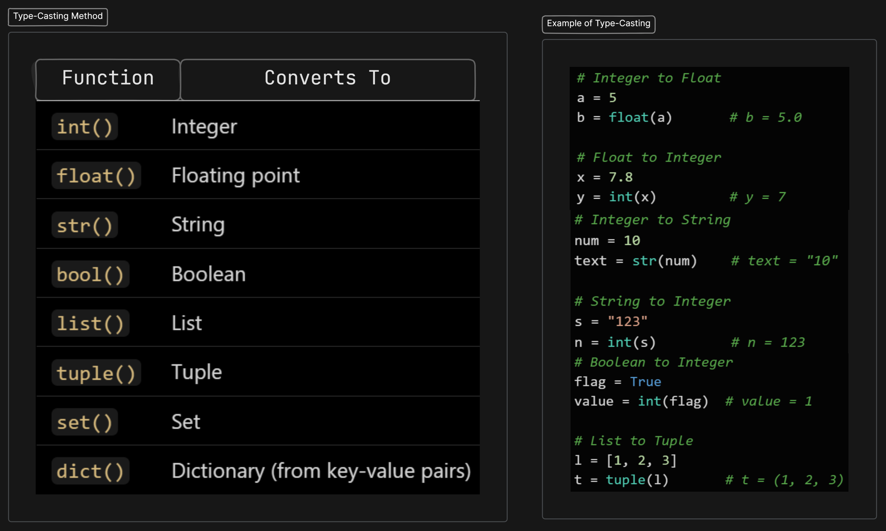
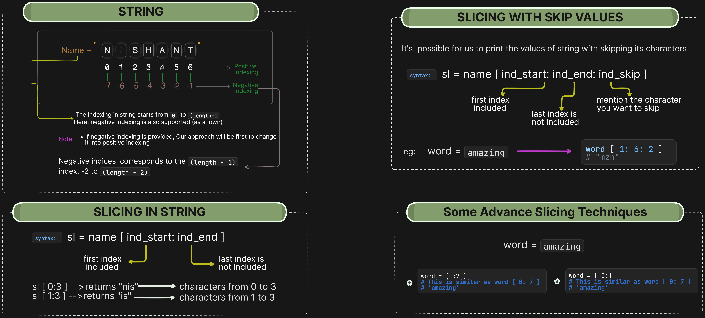

## Python

- It is a high-level language, interpreted language with a broad range of libraries and frameworks, supporting applications in web development, data analysis, AI, and more

- Types of comments:
1. *Single Line Comments*: To write a single line comment just add a ‘#’ at the start of the line.
2. *Multiline Comments*: There are two ways to use this: one by using `#` in every line or use the multiline string (""" """)
   ```py
   # ----> This represents the Single-Line Comment
   """
   Multi 
   Line
   Comment
   """
   ``` 

#### Data Types
- Python automatically identifies the type of data for us and classifies them as:
    - Integer
    - Floating Point Number
    - String
    - Boolean
    - None
- By using the `type(variable_name)` we can find the type of variable
```py
a = 71
type(a)     # class <int> 
b = 71.71
type(b)     # class <float>
c = "71.71"
type(c)     # class <str>
d = True
type(d)     # class <bool>
```

#### Typecasting
- It is a process of converting one data type into another
- Python provides built-in functions for type conversion
- It also raise errors if conversion is not possible
  
  .png>)

### String

- It is a data-type in python that has sequence of characters enclosed in quotes
    ```py
        a = 'nishant'       # Single quoted string
        b = "nishant"       # Double quoted string
        c = '''nishnat'''   # Triple quoted string
    ```

#### String Slicing
- It is used for getting a part of the strings
- Strings are immutable, whenever we apply some methods on it, every time it returns a new value
    

#### Important String Functions
1. `len()`: It returns the length of the strings
   ```py
    str = "nishant"
    print(len(str))  # Output: 7
    ```
2. `endswith()`: It is used to check if a string ends with a specified `suffix`. It returns a `boolean`: True or False.
    ```py
    str = "nishant"
    print(str.endswith("ant"))  # Output: True
    ```
3. `count(character)`: It is used to count the total number of occurence of any characters
    ```py
    str = "nishant"
    count = str.count("a")
    print(count)  # Output: 1
    ```
4. `capitalize()`:This is used to capitalize the first character of string
   ```py
   str = "nishant"
   captialize_string = str.capitalize()
   print(capitalize_string)  # Output: Nishant
   ```
5. `lower() || upper()`: Convert the string into lowercase or uppercase
   ```py
    str = "NISHANT"
    print(str.lower())  # Output: "nishant"
    str2 = "nishant"
    print(str2.upper())  # Output: "NISHANT"
   ```
6. `casefold()`: Converts the string into lowercase i.e, especially designed for case-insensitive string matching
   ```py
   s1 = "Straße"   # German word (means street)
   s2 = "strasse"

   print(s1.lower() == s2.lower())       # False
   print(s1.casefold() == s2.casefold()) # True 
   ```
7. `replace(old, new)`: It is used to replace all the occurence of a substring
   ```py
    str = "nishant"
    updated = str.replace("nish", "sush")
    print(updated)  # Output: "sushant"
   ```
8. `find(word)`: It is used to find a word and returns the first occurence of that word in the string
    ```py
    str = "nishant"
    pos = str.find("sh")
    print(pos)  # Output: 2
    ```
9.  `s[::-1]`: It is used to reverse a string
   ```py
    str = "nishant"
    reversed_str = str[::-1]
    print(reversed_str)  # Output: "tnahsin"
   ```
10. `strip()`: It is used to remove the leading and trailing whitespaces
   ```py
    str = "  nishant  "
    cleaned = str.strip()
    print(cleaned)  # Output: "nishant"
   ```
11. `join(list)`: It is used to join a list of strings into one
    ```py
    words = ["nishant", "gaurav"]
    joined = " ".join(words)
    print(joined)  # Output: "nishant gaurav"
    ```

### List

- A list is a collection of ordered, mutable (changeable) elements. 
- Lists can hold elements of different data types, including other lists.
  ```py
  my_list = [1, 2, 3, "apple", True, 3.14]
  ```
- Properties:
  - **Ordered**: Items have a defined order (index-based).
  - **Mutable**: You can modify, add, or delete items.
  - **Allow Duplicates**: Yes. `[1, 2, 2, 3]` is valid.
  - **Heterogeneous**: Can contain different data types.
- *Ways to Create a `list`*:
  ```py
  # Empty list
    empty = []

  # List of integers
    nums = [1, 2, 3]

  # Mixed types
    mixed = [1, "hello", 3.14, True]

  # Nested list (list within list)
    nested = [[1, 2], [3, 4]]
  ```
- A list can be indexed just like a string
  ```py
  l1 = [7, 9, "Nishant"]

  l1[0]   # 7 
  l1[1]   # 9 
  l1[70]  # error 
  l1[0:2] # [7,9] -> list slicing
  ```
#### **List Methods**:
1. `sort( )`: Sorts the list in ascending order (by default). It returns `none` when you try to store it in other variable
   ```py
   nums = [5, 2, 4, 1]
   nums.sort()
   print(nums)  # Output: [1, 2, 4, 5]

   # For descending:
   nums.sort(reverse=True)
   ``` 
2. `reverse()`: Reverses the list in-place.
   ```py
   nums = [1, 2, 3]
   nums.reverse()
   print(nums)  # Output: [3, 2, 1]
   ``` 
3. `append(x)`: Adds a single element `x` at the end of the list
   ```py
   fruits = ["apple", "gauva"]
   fruits.append("mango")
   print(fruits)
   # Output: ["apple", "gauva", "mango"] 
   ```
4. `insert(index, x)`: Inserts an element `x` at a specififc index in the list
   ```py
   fruits = ["apple", "gauva", "lichi"] 
   fruits.insert(2,"mango")
   print(fruits) 
   # Output: ["apple", "gauva", "mango","lichi"]
   ```
5. `remove(x)`: Removes the first occurence of the element `x`
   ```py
   nums = [1, 2, 3, 2]
   nums.remove(2)
   print(nums)
   # Output: [1, 3, 2]
   ```
6. `pop([index])`:  Removes and returns the element at the specified index. If no index is provided, removes the last item
   ```py 
   nums = [10, 20, 30]
   val = nums.pop()
   print(val)   # Output: 30
   print(nums)  # Output: [10, 20]
   ```
7. `index(x)`: Returns the index of the first occurence of the value `x`
   ```py
   nums = [ 5, 4, 7, 3]
   print(nums.index(3))  # Output: 3
8. `count(x)`: Returns the number of times `x` appears in the list
   ```py
   nums = [1, 2, 2, 3, 2] 
   print(nums.count(2)) # Output: 3
9. `copy()`: Creats a shallow copy of the list
   ```py
   original = [1, 2, 3]  
   copied = original.copy()
   print(copied)    # Output: [1, 2, 3]
10. `len(list)`: Returns the number of items in the list
    ```py
    fruits = ["apple", "banana", "mango"]  
    print(len(fruits))  # Output: 3
    ```

---
### Tuple
- A tuple is an ordered, immutable collection used to store multiple items
- Once created you cannot change its elements (no add/ remove)
  ```py
  person = ('Nishant', 20, 'India') 
  ```
- Properties: 
  - **Ordered**: Elements have a fixed order
  - **Immutable**: Cannot be changed after creation
  - **Indexed**: Yes, supports indexing
  - **Allow duplicates**: Yes, same value can repeat
- *Ways to create `tuple`*:
  ```py
  # Empty Tuple
  t1 = ()

  # Single Element tuple (VVI)
  t1 = (5,)

  # Tuple with elements
  t2 = (1, 2, 3, 4)

  # Mixed elements Tuple
  t3 = (1, "Nishant", True, 3.14)

  # Nested tuple
  t4 = (1, (2, 3), [4,5])

  # Using tuple constructor
  t5 = tuple([1, 2, 3])      # The tuple() function is converting that list into a tuple
  ```
- *Accessing Tuple Elements (Indexing)*:
   ```py
   t = ('a', 'b', 'c', 'd')
   print(t[0])     # a
   print(t[-1])    # d (last element)
   ```
- Slicing happens in the same manner as that of in the list and string

#### Methods in Tuple:
1. `count(value)`: Counts the amount of time a value appears in the tuple
   ```py
   t = (1, 2, 3, 2, 2, 4) 
   print(t.count(2))    # Output: 3
2. `index(value)`: returns the first index where the value appears
   ```py
   t = (5, 8, 7, 8) 
   print(t.index(8))    # Output: 1

### Set
- A set is an unordered, unindexed collection of unique, mutable elements
  ```py
  s = {1, 2, 3}

  # Also created using 
  empty_set = set( )
  # { } -> This creates an empty dictionary, not a set
  ```
- Properties: 
  - **Unordered**: No index, position doesn't matter
  - **Mutable**: Can add or remove items
  - **No Duplicates**: Automatically removed
  - **Indexing**: Not allowed

#### Set Methods:

1. `add()`: Adds a single element
   ```py
   my-set = {1, 2} 
   print(my_set.add(3)) # {1, 2, 3}
   ```
2. `len(x)`: Returns the length of the set
   ```py
   print(len(my_set))   # 3
   ```
3. `remove()`: Removes an element (raises error if element not found)
   ```py
   my_set.remove(2) # Removes 2
   ```
4. `discard()`: Same as remove, but no error if not found
   ```py
   my_set.discard(20) # Safe to use
   ```
5. `pop()`: Removes and returns a random item
   ```py
   item = my_set.pop()
   print(item)
   ```
6. `union({set})`: Returns a new set with all items from both sets
   ```py
   my_set.union({2, 4, 5})
   print(my_set)    # Output: 1, 2, 3, 4, 5
   ```
7. `intersection({set})`: Return a set which contains only item in both sets
   ```py
   my_set.intersection({2, 14, 15})
   print(my_set)    # Output: 2
   ```


### Dictionary
-  It is a collection of key-value pairs. Each key is unique, and each key maps to a value.
   ```py
   my_dict = {
    "name": "Alice",
    "age": 25,
    "city": "Paris"
    }
    # Using `dict()` function
    my_dict = dict(name = "Nishant", age = 18)
   ```
-  Properties: 
   -  Mutable
   -  No duplicates key allowed
   -  key must be unique and immutable(string, int, tuple, etc.)
- **Access**:
  ```py
  # Using `key`
  print(my_dict["name"])    # Output: Alice
  # If key doesn't exist, error occurs 
  
  # Using `get()`
  print(my_dict.get("age"))  # Output: 25
  print(my_dict.get("gender", "Not Found"))  # Output: Not Found
  ```
- **Modification**:
  - Change a Value
  ```py
  my_dict["age"] = 26
  ``` 
  - Add a new key-value pair
  ```py
  my_dict["gender"] = "Female"
  ```
- **Nesting**:
     ```py
    student = {
    "name": "John",
    "marks": {"math": 90, "science": 88}
    }
    print(student["marks"]["math"])  # Output: 90
    ```

#### Dictionary Methods:
1. `get(key, default)`: Safely access a value for a key and Returns `default` if the key doesn't exist.
    ```py
    d = {"a": 1, "b": 2}
    print(d.get("a"))         # Output: 1
    print(d.get("c", 0))      # Output: 0 (default)
    ```
2. `keys()`: Returns a view of all keys.
   ```py
   d = {"a": 1, "b": 2}
   print(d.keys())  
   # Output: dict_keys(['a', 'b'])
   ```
3. `values()`: Returns a view of all values.
   ```py
   print(d.values())  
   # Output: dict_values([1, 2])
   ```
4. `items()`: Returns all key-value pairs as tuples.
   ```py
   print(d.items())  
   # Output: dict_items([('a', 1), ('b', 2)])
   ```
5. `update(other_dict)`: Merges another dictionary into the current one and overwrites existing keys.
   ```py
   d.update({"b": 20, "c": 30})
   print(d)  
   # {'a': 1, 'b': 20, 'c': 30}
   ```
6. `pop(key)`: Removes the key and returns its value and raises error if key not found.
   ```py
   value = d.pop("a")
   print(value)  # Output: 1
   ``` 
7. `popitem()`: Removes and returns the last inserted key-value pair 
   ```py
   last_item = d.popitem()
   print(last_item)  # Example: ('c', 30)
   ```


### Conditional Expression:

1. `if`:
   ```py
   if condition:
      # code block
   ``` 
2. `if-else`:
   ```py
   if condition:
      # code block gets executed if condition is True
   else:
      # code block gets executed if condition is False
   ``` 
3. `if-elif-else`:
   ```py
   if condition:
      # code block
   elif condition:
      # code block
   elif condition:
      # code block
   else:
      # code block
   ``` 
4. `Nested if`:
   ```py
   if condition:
      if condition:
         #code block
      else:
         # code block
   else:
      # code block
   ``` 

### Loops in Python:
1. `for`
   ```py
   for variable in sequence:
      # code block

   # Example:
   fruits = ["apple", "banana", "mango"]
   for i in fruits:
      print(fruit) 
   ```
2. `for` loop with `range()`:
   - `range(start, stop, step)` generates a sequence of numbers.
   ```py
   for i in range(5):
      print(i)
   ```
4. `for` loop with `else`:
   ```py
   l = [1, 7, 8]
   for item in l:
      print (item)
   else:
      print("done") # this is printed when the loop exhausts!
   ```
5. `while`
   ```py
   while condition:
      # code block
   ```
6. `nested`
   ```py
   for i in range(1, 3):  # Outer loop
    for j in range(1, 4):  # Inner loop
        print(f"i = {i}, j = {j}")
   ```
7. `break`, `continue`, `pass`
   - break : immediately exits the loop
   - continue: skip the current iteration, continue the next
   - pass: do nothing, just a placeholder
  
### Function
- A function is group of statement performing a specific task
  ```py
  def function_name (parameters):
      # code block
  ```
- `def` keyword is used to define a function
- functions can return data using the return keyword
- One can give default values to parameters.
  ```py
   def greet (name = "Guest"):
      print("Hello", name)
   greet()
   greet("Nishant")
  ```

### Recursion
- When a function call itself inside its body
  ```py
  def recursive_function():
    if condition:
        return result
    else:
        recursive_function()
  ```
   - A Base Case ➔ to stop the recursion
   - A Recursive Case ➔ the function calls itself

### File System in Python:
- A file is a collection of data which is stored in the storage device
- There are two types of files:
  - Text Files: They stored the readable characters (`.txt`, `.py`, `.csv`, etc.)
  - Binary Files: They stored data in binary format (`.jpg`, `.exe`, `.mp3`, etc.)
- For persisting the data forever we use files.

#### Opening a File
- Python has an `open()` function for opening files
- It takes two parameters filename and mode
   ```py
   # Syntax
   file_object = open("filename", "mode")

   # Example
   f = open("myfile.txt", "r")   # open file in read mode
   ```
- Different file modes:
  - `r`: It means to read a file. If not specified, this is the default mode. It gives error if the file is not found 
  - `w`: It means writing in a file. It creats a new or overwrites on the existing files
  - `a`: It means append. It adds content at the end of the file
  - `r+`: It means read and write. For this, file must exist
  - `w+`: It means write and read. It is used for overwriting the file 
  - `a+`: It means append and read. It reads and writes at the end of the file
  - `rb`/ `wb`: These are for binary modes. It is used in images, videos, etc

### Closing a File
- After using a file, we must close it to free resources.
- If you don’t close, sometimes data won’t be written properly.
   ```py
   f = open("myfile.txt", "r")
   print(f.read())   # read file content
   # Close the file
   f.close()        
   ```
- For avoiding the burden of closing the files every time, we use `with` statement. It automatically closes the file
  ```py
  with open("myfile.txt", "r") as f:
    data = f.read()
  print(data)
  ``` 

#### Reading from Files 
- After opening the file in read (`r`) mode, we can get the content in different ways:
   1. `.read()`:
       - Read the whole file content, considering it as a single string
       ```py
       content = f.read()
       print(content)
       f.close()
       ```
       - We can also specify the number of characters, we want to read
       ```py
       f = open("hello.txt", "r")
       print(f.read(5))     
       f.close()
       ```
   2. `.readline()`:
   - It reads one line (till `\n`) at a time and mostly used when we want to read a file line by line
   ```py
   f = open("hello.txt", "r")
   print(f.readline())   # Reads first line
   print(f.readline())   # Reads second line
   f.close()
   ```
   - It reads the line till we get an empty string
   ```py
   # We have a file that contains 4 line 
   # If we want to print the file for the fifth time using the `.readline()` function, it shouldn't print anything
   # This means, it  will print upto it finds an empty string, if it finds the empty string in the file it stops printing
   # We can check this using:
   print(line == "") # True
   ``` 
   3. `.readlines()`:
   - It reads all lines and stores them in the list
   ```py
   f = open("hello.txt", "r")
   lines = f.readlines()
   print(lines)   # ['Hello, Python File System!\n', 'Second line\n']
   f.close()
   ```
   4. `Iterating Over File`: (Memory Efficient)
   - Instead of `.readlines()`, we can directly loop through a file:
   ```py
   f = open("hello.txt", "r")
   for line in f:
      print(line.strip())   # strip() removes \n
   f.close()
   ```

#### Writing to Files:
- When we want to save data permanently, we need to write into files
- There are mainly two ways to write :
  1. `.write()`:
  - It writes a single string to the file
  - If the file already exists:
    - `w`: This will overwrites the content of the file (erase old content)
    - `a`:  This will appends the content into the file (adds at the end). It is always safe to use this mode.
  2. `writelines()`:
  - It is used for writing multiple lines i.e, it takes a list of string and writes them
  - It doesn't automatically adds the `\n`, so you must include it by yourself  
  ```py
  f = open("shopping.txt", "w")
   items = ["Milk\n", "Eggs\n", "Bread\n"]
   f.writelines(items)
   f.close()
   ```

### OOP's:

- It stands for **Object Oriented Programming** where we solve a problem by creating the objects and it focuses on using reusable code (DRY Principle)
- **Class**: It is a blue print f creating an object
  ```py
   class Employee:   # It's always suggested to keep the first letter capital
      # Methods and Variables
  ```
- **Objects**: 
  - An object is an instance of the class
  - Memory is allocated after the objecy instantiation
  ```py
   e1 = Employee   
  ```
- An attribute that belongs to the class rahter than a particular object are called class attributes
- An attributes that belongs to the Instance (object)
  ```py
   class Employee:
      company = "Google"   #Specific to Each Class
      salary = "60k"
   nishant = Employee() # Object Instiation
   nishant.company 
   Employee.company = "YouTube" # Changing Object Attribute

   nishant.name = "Nishant"   #Object Attribute
   nishant.salary = "98k"
   # Here, when we print the salary, it'll print 98k instead of 60k. Because, Instance attribute takes preference over class attributes during assignment retrival
  ```

```py
class Dog:

   def __init__ (self, name, breed):
      self.name = name
      self.breed = breed
   
   def bark(self):
      print("Whaooo....Whaooo....")

   # When we want that the function don't use the self parameter, we can define them using the static method:

   @staticmethod # decorator to mark legs as a static method 
   def legs():
      print("Every dogs have 4 feet")

   '''
    __init__() :
      - A special method which runs first as  soon as the object is created 
      - Also known as constructor
      - It takes "self" argument
   
    Self Parameter:
      - It refers to the instance of the class 
      - It is automatically passed with a function call from an object
   '''
```

### Inheritance:
- It is a way of creating a new class from an ecisting class
  ```py
  class Employee:    # Base Class
         # Code
   class Programmer(Employee):  # Derived or child Class
         # Code

   # One can us the method and attributes of "Employee" in "Programmer" object
  ```
- Types:
  - **Single**: It occurs when child class inherits only a single parent class.
```py
   class Animal:
    def speak(self):
        print("Animal speaks")

   class Dog(Animal):
    def bark(self):
        print("Dog barks")
 ```
   - **Multiple**: It occurs when the child class inherits from more than one parent classes
```py
      class Writer:
      def write(self):
         print("Writing...")
      class Reader:
      def read(self):
         print("Reading...")

      class Editor(Writer, Reader):
         pass
```
  - **Multi-Level**: When a child class becomes a parent for another child class.
```py
   class Grandparent:
    def fun1(self):
        print("I am the Grandparent.")
   class Parent(Grandparent):
    def fun2(self):
        print("I am the Parent.")
   class Child(Parent):
    def fun3(self):
        print("I am the Child.")
``` 
- **super()**:
  - It is a built-in function used ti access methods and properries of a parent or superclass from inside a child or subclass
  - Use Cases:
    ```py
    # Initializing Parent Attributes
    class Employee:
      def __init__(self, id, name):
         self.id = id
         self.name = name
    class Manager(Employee):
      def __init__(self, id, name, dept):
         # Initializes attributes from Employee
         super().__init__(id, name)
         self.dept = dept
   
    mgr = Manager(101, "Nishant", "Sales")
    print(mgr.id, mgr.name, mgr.dept)
    ```
    ```py
    # Overriding Parent Method
    class Animal:
      def speak(self):
         print("Gneric animal sound")
    class Dog(Animal):
      def speak(self):
         super().speak()
         print("Bark!!")
    d = Dog()
    d.speak()

    # Output:
    Generic animal sound
    Bark!
    ```
    ```py
    # Multiple Inheritance Example
    class A:
      def show(self):
         print("A")
    class B(A):
      def show(self):
         super().show()
         print("B")
    b = B()
    b.show()     
    # Prints: A \n B
    ```
#### class method:
- A class method is a method which is bound to the class and not the object of the class.
- *@classmethod* decorator is used to create a class method
   ```py
   @classmethod
      def(cls, p1, p2):
   ```

#### Property Decorators:
```py
class Employee:
   @property
   def name(self):
      return self.ename
```
- If e = Employee() is an object of class employee, we can print (e.name) to print the ename by internally calling name() function
  
#### @.getters and @.setters
- The method name with ‘@property’ decorator is called getter method
```py
@name.setter
   def name (self,value):
      self.ename = value
```