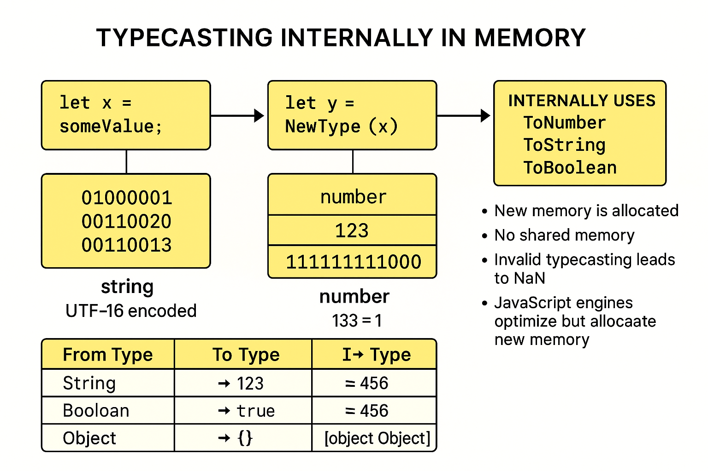
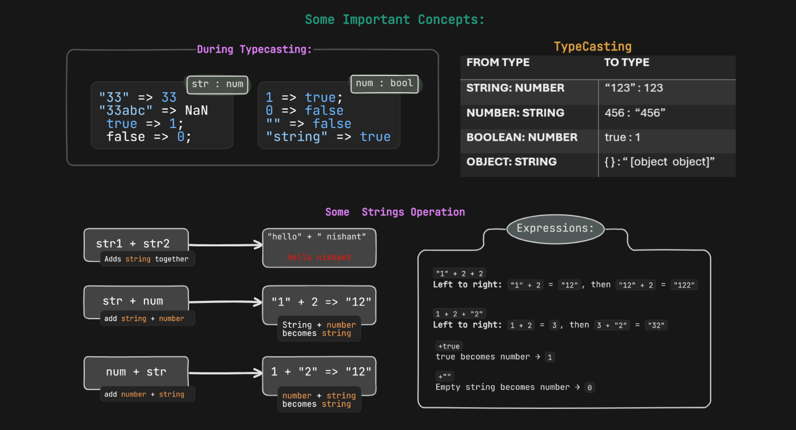

## JavaScript

### DataType and ECMA Standards
- We use **"use strict;"** to treat all the JavaScrpit code as the newer version. Nowadays, its mandatory to write this 
- We use the ```alert("whatever you want to make pop up")``` keyword to create a pop to any website.
- [Documentation of JavaScript](https://tc39.es/ecma262/#sec-intro)


- Data-types are categories into two types on the basis of how data is stored in the memory and how it is used:
  - Primitive (call by value):
    - number ( Range 2^53 )
    - boolean (True/ False)
    - string ( written in " ", ' ' )
    - bigint ( for wider range of number )
    - null ( standalone value  )
        - It's a type of object
    - undefined ( value is not assigned )
    - symbol ( uniquness )
  - Non-Primitive (Refrence Type)
    - arrray
    - object
    - function
- In case of memory:
  - Primitive takes stack memory, only its value is passed not the reference
  - Non-Primitive takes heap memory

### Data Conversion

- For conversion of datatypes we use **Number, String,** etc
    
    - In case of `null` the final coversion is `0`
    - In case of `undefined` the final conversion is `NaN`
    - In case of `boolean`:
      - 1 is converted into True
      - 0 is converted into False
      - "" (empty string) is converted into False 
      - "string" is converted into True

### Typecasting
- Typecasting (also called type conversion) is the process of converting a value from one data type to another.
- JavaScript does typecasting in two ways:
  - **Implicit** (Automatic)  
  - **Explicit** (Manual by developer)

- **Implicit Typecasting** (Type Coercion)
    - JS automatically converts types during operations.

    ```js
    Examples:
    "5" + 2        // "52"   (number → string)
    "5" - 2        // 3      (string → number)
    true + 1       // 2      (boolean → number)
    ```





### Date and Time 
- Date are the `object` represent in a single moment in time in a platform independent format
- It returns an integer value that represents milliseconds since the midnight at the negining of `January 1, 1970`
- Way to create a Date object:
  ```js
  let myDate =  new Date();
  ```  
  - `new Date()` = It creates a new Date object with the current date and time.
  - The `Date` object is used to work with dates and times in JS.
  ```js
  console.log(myDate);    
  ```
  - Output: 2025-04-21T07:58:21.670Z 
  - It's not redable so we need to convert them, using different methods.
- Different Date Output Formats:
  ```js
  myDate.toString();         // Full date & time string
  myDate.toDateString();     // Only date (e.g., "Sat Jan 14 2023")
  myDate.toLocaleString();   // Locale specific date & time
  typeof myDate;             // Object
  ```
- Creating Custom Dates:
  ```js
  let myCreatedDate = new Date(2023, 0, 23);
  let myCreatedDate = new Date(2023, 0, 23, 5, 3);
  let myCreatedDate = new Date("2023-01-14");
  let myCreatedDate = new Date("01-14-2023");
  ```
  - `new Date(year, monthIndex, day, hour, minute)` → creates a specific date.
  - Month index starts from `0` (Jan = 0, Feb = 1…).
- TimeStamps and its working:
  ```js
  let myTimeStamp = Date.now();
  ```
  - Date.now() → returns the number of milliseconds since January 1, 1970
  - Use: For comparing time differences, calculating durations, or storing consistent time data 
  ```js
  myCreatedDate.getTime();
  ```
  - getTime() → gives the timestamp of a specific date
  - Use: Helps in comparing two dates or calculating how much time has passed since a given date.
  ```js
  // Converting Timestamp to Seconds
  Math.floor(Date.now() / 1000);
  ```
  -  Use: Used in backend systems, authentication tokens, and databases to store time in seconds.
  ```js
  // Way to Extract Date Part:
  let newDate = new Date();
  newDate.getMonth();  // returns 0-based index of month.(0-11)
  newDate.getDay();    // returns day of the week (0 = Sunday, ..., 6 = Saturday)
  newDate.getMonth() + 1 // Gives human-friendly month number (1-12)
  ``` 
---
### Array 

- An array is a special variable that can hold multiple values at once
  ```js
  const arrName = [value1, value2, value3, ...];
  ```
- We can create the `array` in JS in two ways:
  - Literals
  - Constructor
    ```js
    const myArr = [0, 1, 2, 3, 4, 5]
    // Here, each thing is an element and each element can be number, string, array, etc

    // Other way of declaration:
    const myOtherArr = new Array (1, 2, 3, 4)     // Uses Array Constructor function
    ```
- `Note`:
  - While using the `new Array (x)` method be careful:  It creats an empty array of length `x` not an array having a single `[x]` element in the array
  ```js
  const arr2 = new Array(3);
  console.log(arr2);              // [ <3 empty items> ]
  console.log(arr2.length);       // 3

                                            // OR

  const arr = new Array(3);
  arr[0] = 42;
  console.log(arr);               // [42, <2 empty items>]
  ```
- The `array` object enables storing a collection of multiple items under a single variable name, and has members for performing common array operations
  ```js
  let mixed = [1, "hello", true, [2, 3], {key: "value"}]
  ```  
- Properties:
  - Arrays are resizable and can contain a mix of different data types
  - One can add/remove elements even after the array is created
  - JS arrays are not associative arrays means they are only accessed using index or it may be negative
  - Arrays are zero-indexed
  - It creats shallow copy rather than deep copy

- `Spread Operator(...)`
  ```js
  let arr1 = [1, 2];
  let arr2 = [...arr1, 3, 4];
  // [1, 2, 3, 4]
  ```
#### Array Functions:
1. `push()`: Add elements to the end of the array
  ```js
  let arr = [10, 20, 30];
  arr.push(40);
  console.log(arr);            // [10, 20, 30, 40]
  ``` 
2. `pop()`: Remove the last element from the array and it returns the removed element
  ```js
  let arr = [10, 20, 30];
  let last = arr.pop(); 
  console.log(last);           // 30
  console.log(arr);            // [10, 20]
  ``` 
3. `shift()`: Removes the first element of the array
  ```js
  let arr = [10, 20, 30];
  let first = arr.shift();
  console.log(first);         // 10
  console.log(arr);           // [20, 30]
  ``` 
4. `unshift()`: Adds elements to the beginning of the array; it returns the new array length
  ```js
  let arr = [2, 3];
  arr.unshift(1); 
  console.log(arr);             // [1, 2, 3]
  ```
5. `slice(start, end)`: Returns a shallow copy of a portion of the array and it doesn't modify the original array
  ```js
  let arr = [1, 2, 3, 4];
  let sub = arr.slice(1, 3); 
  console.log(sub);             // [2, 3]
  ```
6. `includes(x)`: Checks if the array contains a certain value and it returns *true* or *false*
  ```js
  let arr = [1, 2, 3, 4];
  let sub = arr.slice(1, 3); 
  console.log(sub);             // [2, 3]
  ```
7. `indexOf(x)`: Finds the first index of a value and it returns `-1` if not found 
  ```js
  let arr = [1, 2, 3, 2];
  console.log(arr.indexOf(2));        // 1
  ```
8. `find(callback)`: Finds the first element that passes a test and returns the value not the index
  ```js
  let arr = [5, 12, 8];
  let found = arr.find(x => x > 10);      // use of arrow function 
  console.log(found);                     // 12
  ```
9. `reverse()`: Reverse the array in-place
  ```js
  let arr = [1, 2, 3];
  arr.reverse();
  console.log(arr);                 // [3, 2, 1]
  ```
10. `Array.from(arrayName)`: 
  - It is a static method used to create a new array from:
    - Array like-objects (e.g., Arguments, NodeList)
    - Iterable objects  (e.g., strings, sets)
  ```js
  Array.from("abc");                            // ['a', 'b', 'c']
  Array.from([1, 2, 3], x => x * 2);            // [2, 4, 6]
  Array.from({ length: 3 }, (_, i) => i);       // [0, 1, 2]
  ```


### Object:
- An object is a collection of properties, where each property is a key-value pair
  - Keys are always strings or symbols
  - Values can be anything: numbers, strings, other objects, functions
- Objects don't have many instances
- ***Use of Objects***:
  - Stores data as well as complex entities and behavior
  - Stores structured data efficiently
- ***Creating Objects***:
  - Literal
  - Constructor
    - Objects become singleton whenever it's created via constructor
- `syntax`
  ```js
    let person = {
    key1: value1,
    key2: value2,
    ...
  };
  e.g.,
  let person = {
    name: "Nishnat",
    age: 21,
    isStudent: true
  }
  ```
- ***Accessing Objects***:
  - Dot Notation
    ```js
    console.log(person.name); // Nishant
    ``` 
  - Bracket Notation
    ```js
    console.log(person["name"]); // Nishant
    ``` 
    - Use when:
      - The key has spaces `(person["full name"])`
      - When using a dynamic key
      ```js
      let key = "age";
      console.log(person[key])    // 21
      ```
- ***Modifying Object Properties***:
  ```js
  // Updation:
  person.age = 30;
  // Add a new property:
  person.city ="muzaffarpur"
  // Delete a property:
  delete person.isStudent;
  ``` 
-  ***`Symbols` as Object Keys***
     -  `Symbols` can be used as non-string property keys. Unlike strings, they won’t show up in typical loops like `for...in`.
    - Create object with symbol key:
      ```js
      const myKey = Symbol("secretKey");

      let obj = {
        [myKey]: "This is a secret value"
      };

      console.log(obj[myKey]); 
        // Output: This is a secret value
      ```
     - Wrong ways:
      ```js
      let obj = {
        mykey : "This is a secret value"
      }
      console.log(obj.myKey);
      console.log(obj["myKey"]);
      ``` 
